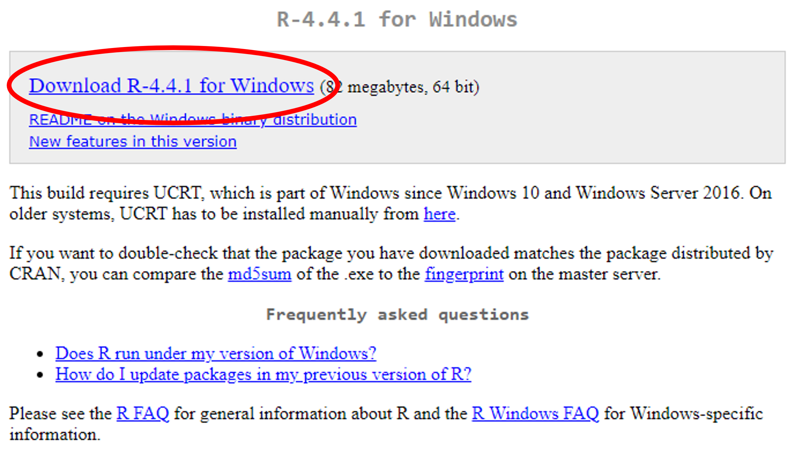
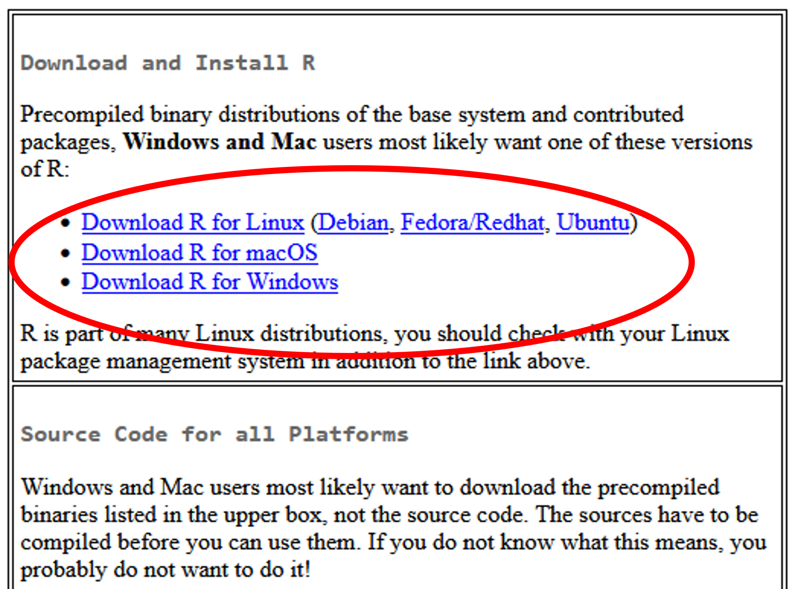
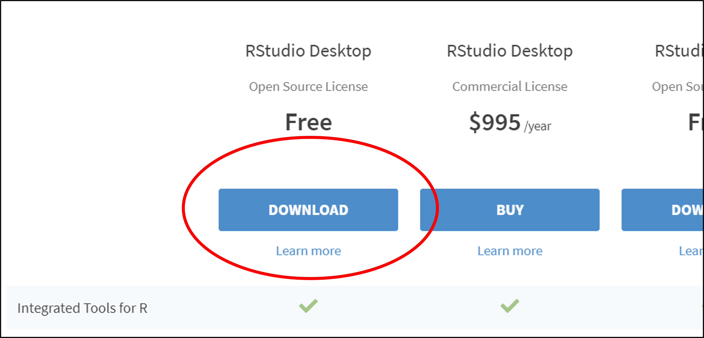

# Downloading R and RStudio {#downloadingR}

This section contains a guide to downloading and setting up both [R](https://cran.r-project.org/) and [RStudio](https://posit.co/products/open-source/rstudio).

::: {.warning-box}
⚠️ It is important that you download **both** R and RStudio. Download R first, before downloading RStudio
:::

## Downloading R for Windows 

R can be downloaded from <a href="https://cran.r-project.org/bin/windows/base/" target="_blank" title="Go to CRAN">CRAN (the Comprehensive R Archive Network)</a>.

Click “**Download R-4.4.1 for Windows**”.

<figure>
    

        
        <figcaption style="text-align:center">
            Figure 1: How to download R for Windows <b><em>R</b></em> for Windows.
        </figcaption>
    

</figure>

When the file has downloaded, open it to run the installation.

We would recommend you agree with the default settings and perhaps consider clicking the boxes to add a desktop shortcut and a **Quick Launch** shortcut.

## Downloading R for other operating systems

Go to <a href="https://cran.r-project.org" target="_blank" title="Go to CRAN">CRAN (the Comprehensive R Archive Network)</a>. Select the appropriate operating system from the options given then download the latest release from the following page.

<figure>
    

        
        <figcaption style="text-align:center">
            Figure 2: How to download R for for other operating systems.
        </figcaption>
    

</figure>

## Downloading RStudio 

To download Rstudio, go to  the [Rstudio webpage](https://posit.co/products/open-source/rstudio). 
Select the free version of RStudio and click **Download**.

<figure>
    

        
        <figcaption style="text-align:center">
            Figure 3: Downloading the free version of RStudio. <b><em>RStudio</b></em>.
        </figcaption>
    

</figure>

Click **Download** RStudio **for Windows** (or different operating system).

## Video Content

<iframe id="kaltura_player" 
        type="text/javascript"
        src='https://cdnapisec.kaltura.com/p/2103181/embedPlaykitJs/uiconf_id/53345422?iframeembed=true&entry_id=1_ka7y3137&config[provider]={"widgetId":"1_bd4wfuwh"}'
        style="width: 80%; height: 450px; border: 0;"
        allowfullscreen
        webkitallowfullscreen
        mozAllowFullScreen
        allow="autoplay *; fullscreen *; encrypted-media *"
        sandbox="allow-downloads allow-forms allow-same-origin allow-scripts allow-top-navigation allow-pointer-lock allow-popups allow-modals allow-orientation-lock allow-popups-to-escape-sandbox allow-presentation allow-top-navigation-by-user-activation"
        title="1. Downloading R and RStudio">
</iframe>

