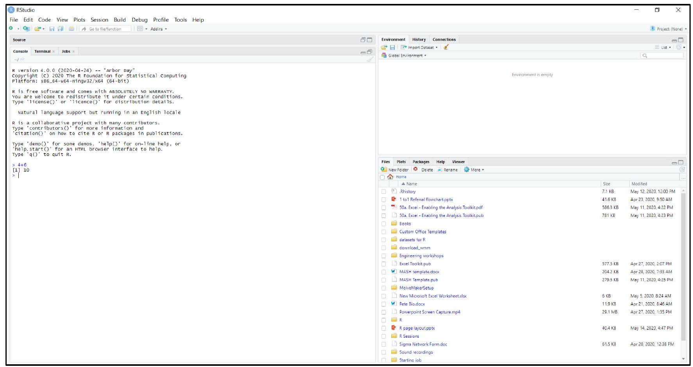
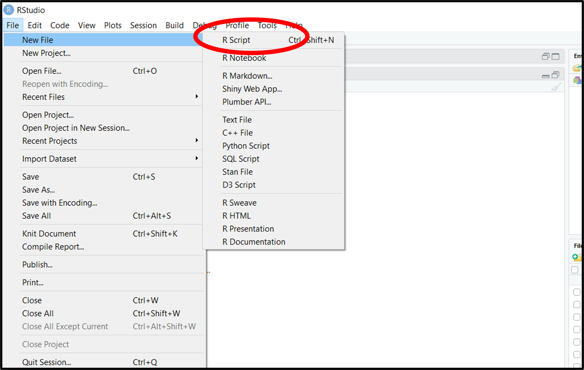
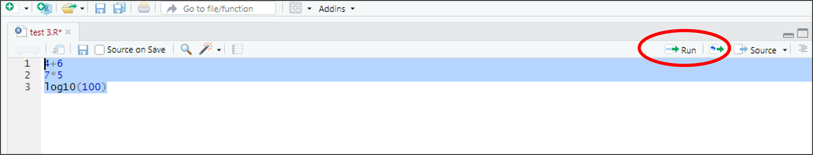
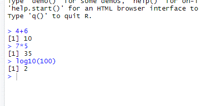
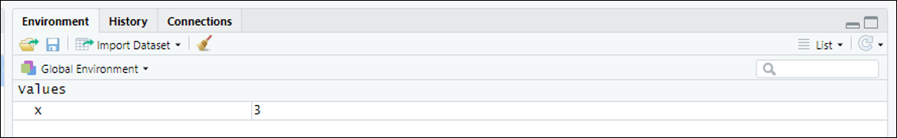

# First interactions with R and RStudio

## Introduction 

This document is part of our "First Steps in ***R***" resources. It is assumed that the reader has downloaded ***R*** and ***RStudio***. No other pre-knowledge is required.

Most of the time we are used to interacting with a computer through a Graphical User Interface (GUI) (i.e. with folders, files, windows etc). In ***R*** and ***RStudio***, we type instructions (code) instead. The window the instructions are typed into is called the console. Of course, we must type our instructions in a way the computer will understand - this is why it's called a programming *language*. This is the way computers were operated before the development of GUIs. ***R*** is a programming language which has been developed specifically for doing statistics. ***R*** and ***RStudio*** are pieces of software which allow the computer to read the code we type and execute it (i.e. follow the instructions).

## Opening ***R***

If you open the ***R*** software you will get a window in which you can type code. This is the console. It is possible to use the ***R*** package to do statistics with ***R*** but ***RStudio*** is much more friendly to use. ***RStudio*** is called an Integrated Development Environment (IDE) for ***R***. Note that for ***RStudio*** to work, it requires that ***R*** is also installed. Because of its ease of use, once you've used ***RStudio***, you will probably find you never open ***R*** again! All of the materials in this series use ***RStudio*** for this reason.

## First Opening ***RStudio***

When you open ***RStudio*** for the first time there will be three windows. The one on the left is the console. You can type code directly in here and ***RStudio*** will follow your instructions as soon as you press return. One thing ***R*** can do is simple calculations like a calculator. You can experiment by typing calculations in the console. If you type <code style="color:blue;">4+6</code> and press return, ***R*** will give you the answer $10$.

<figure>
    

        
        <figcaption style="text-align:center">
            Figure 1: <b><em>RStudio</b></em> when it is opened for the first time.
        </figcaption>
    

</figure>

If you'd like to carry out other calculations, here are the ways you must enter them into ***RStudio*** for some simple operations.

| Arithmetic Operation | R Code |
| :---: | :---: |
| $4+6$ | <code style="color:blue;">4+6</code> |
| $6-4$ | <code style="color:blue;">6-4</code> |
| $4 \times 6$ | <code style="color:blue;">4*6</code> |
| $4 \div 6$ | <code style="color:blue;">4/6</code> |
| $4^{6}$ | <code style="color:blue;">4^6</code> |
| $\mathrm{e}^{4}$ | <code style="color:blue;">exp(4)</code> |
| $\log_{10} (4)$ | <code style="color:blue;">log10(4)</code> |
| $\ln(4)$ | <code style="color:blue;">log(4)</code> |

Note that you cannot go back and delete text you have put in the console. If you've never done any coding at first this may seem strange but you'll get used to it quickly.

## Inputting Code Using a Script

A Script is the name for some code that has been written and which we want ***R*** to execute for us. You can write a script, edit it, save it then open it in ***RStudio*** and run it whenever you like. ***RStudio*** will let you let you edit your script until you're happy with it and then run all or just some of it by highlighting and clicking run. If you choose "**Save As**..." in the file menu (as you would when saving, say, a ***Word*** document) the script is what gets saved. To create a **Script file** for the first time, in ***RStudio***, click "**File**" then select "**New File**" and "**R Script**."

<figure>
    

        
        <figcaption style="text-align:center">
            Figure 2: How to create a Script file in <b><em>RStudio</b></em> for the first time.
        </figcaption>
    

</figure>

A fourth window opens up on the top left in ***RStudio***. Try typing a few calculations in here. You will see that ***RStudio*** will let you type without carrying out any of the calculations. See what happens if you highlight the text and click "**Run**."

<figure>
    

        
        <figcaption style="text-align:center">
            Figure 3: The fourth window, for scripts, in <b><em>RStudio</b></em>.
        </figcaption>
    

</figure>

You should find that all the calculations are carried out at once in the console like so:

<figure>
    

        
        <figcaption style="text-align:center">
            Figure 4: The calculations are carried out in the console in <b><em>RStudio</b></em> all at once when the script is run.
        </figcaption>
    

</figure>

## The Environment

As we write code, we will create "***objects***". The word has a technical use in ***R*** programming which we will deal with in future worksheets. For now we will think of an object as being similar to a variable in algebra - i.e. a letter to which we can assign a value.

We can tell ***R*** that we are creating a new object using the "***assignment operator***":

    <code style="color: blue;">&lt;-</code>

You can think of this as an arrow. The name of the new object should go on the left and the definition goes on the right. So the code

    <code style="color: blue;">x &lt;- 3</code>

would create a new object called <code style="color: blue;">x</code> which is defined to have the value $3$. If we then type
    

    <code style="color: blue;">x+4</code>

We should find that ***R*** calculates $3+4$ and returns the answer $7$.

Type

    <code style="color: blue;">x &lt;- 3</code>

in the console then look in the top right window. You should find that it looks like this.

<figure>
    

        
        <figcaption style="text-align:center">
            Figure 5: The top right window (the "Environment") in <b><em>RStudio</b></em>, where <code style="color: blue;">x</code> is defined to have the value $3$.
        </figcaption>
    

</figure>

(Note: You can use <code style="color: blue;">=</code> as an assignment operator as well as <code style="color: blue;">&lt;-</code>. However, there is a technical difference in the way ***R*** reads <code style="color: blue;">=</code>. In most situations, either <code style="color: blue;">=</code> or <code style="color: blue;">&lt;-</code> can be used interchangeably but it is a good practice to stick to <code style="color: blue;">&lt;-</code> when defining a new object.)

When we are writing code we may want to define many new objects. These objects then exist in the ***R*** "Environment". As we create new objects, the top right window keeps a record of them for us. This helps us keep track and can help us ensure that we do not create two objects with the same name.

We can ask ***R*** to give us the same information by typing <code style="color: blue;">ls()</code> in the console. "ls" is short for list - we are asking ***R*** to list all the objects in the environment.

You can remove an object from the environment by typing

    <code style="color: blue;">rm()</code>

with the name of the object in the brackets.

For example,

    <code style="color: blue;">rm(x)</code>

would remove our variable <code style="color: blue;">x</code> from the environment.

You can delete all objects from the environment by clicking the broom icon in the top ribbon of the "Environment" window:
    
<figure>
    

        
        <figcaption style="text-align:center">
            Figure 6: How to delete all objects from the environment in <b><em>RStudio</b></em>.
        </figcaption>
    

</figure>

Alternatively, you can type the following command in the console:

    <code style="color: blue;">rm(list=ls())</code>

(Note: we don't need to worry about the details of this command at the moment but in case you're interested: "rm" tells ***R*** to remove the thing in the brackets. The rest of the code tells ***R*** that it is going to remove an object which is a "list" and that list is called <code style="color: blue;">ls()</code>. A "list" is a category of object in ***R***. <code style="color: blue;">ls()</code> is specifically the list of everything in the environment.)

## The Bottom Right Window

There are several tabs in the window in the bottom right. For the moment we will only worry about two of them: "Plots" and "Help". If we ask ***RStudio*** to draw a graph or chart, it will appear in this window under this tab. If we ask ***RStudio*** for help - which we will often do when learning how to use a new piece of code - the answer will appear under the "Help" tab.

## Exercise

1. In the console, create an object called <code style="color: blue;">y</code> and give it the value $15$.  
2. Create another object called <code style="color: blue;">z</code> and give it the value $5$.  
3. Calculate <code style="color: blue;">y</code> divided by <code style="color: blue;">z</code>.  
4. Clear the environment and repeat the above by writing a script to do all three stages and running it.
5. Change the value of <code style="color: blue;">y</code> in your script to $20$ and run it again.

### Solutions

Solutions

    
1. <code style="color: blue;">&gt; y &lt;- 15</code>    

2. <code style="color: blue;">&gt; z &lt;- 5</code>  
<code style="color: blue;">&gt; y</code>   
<code>[1] 15</code>    
<code style="color: blue;">&gt; z</code>   
<code>[1] 5</code> 

3. <code style="color: blue;">&gt; y/z</code>    
<code>[1] 3</code>

4. Script:  
<code>y &lt;- 20</code>  
<code>z &lt;- 5</code>  
<code>y</code>  
<code>z</code>  
<code>y/z</code>  
And here it is run:  
<code style="color: blue;">&gt; y &lt;- 20</code>   
<code style="color: blue;">&gt; z &lt;- 5</code>  
<code style="color: blue;">&gt; y</code>   
<code>[1] 20</code>    
<code style="color: blue;">&gt; z</code>   
<code>[1] 5</code>    
<code style="color: blue;">&gt; y/z</code>    
<code>[1] 4</code>

