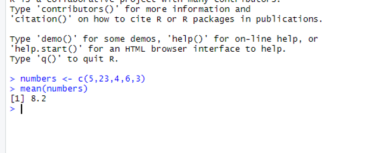
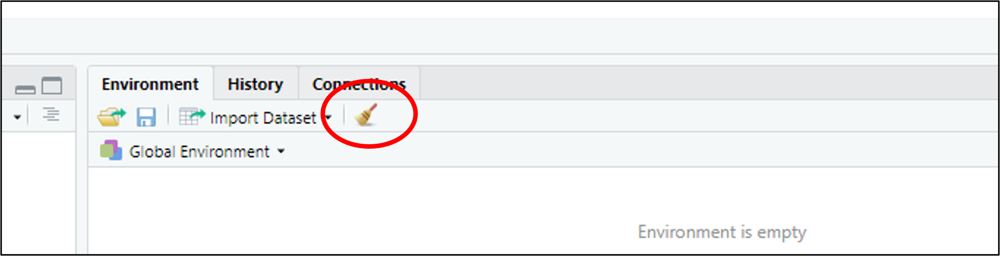
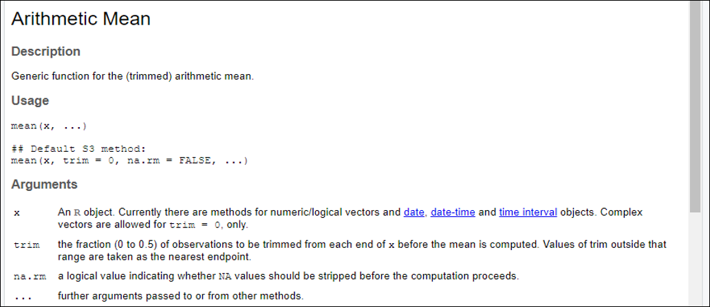

# Functions 

## Introduction 

This document is part of our "First Steps in ***R***" resources. It is assumed that the reader knows how to define a vector in ***R***. Defining vectors is dealt with in the previous document in this series which can also be found on the MASH website.

## Doing Calculations with Functions

When we type a function into the console, we say we are **calling** the function. For our first example we will call the function "mean". This function calculates the mean of the numbers in a numerical vector. First, we will define a numerical vector, for example:

    <code style="color: blue;">numbers &lt;- c(5,23,4,6,3)</code>

We can now call the function <code style="color: blue;">mean</code>:

    <code style="color: blue;">mean(numbers)</code>

If we type these two lines of code into the console, ***R*** will calculate the mean of the numbers in the vector:

<figure>
    

        
        <figcaption style="text-align:center">
            Figure 1: The mean of <code style="color: blue;">numbers</code> is outputted in the console in <b><em>RStudio</b></em>..
        </figcaption>
    

</figure>

Alternatively, we can define the vector within the brackets of the function. For example:

    <code style="color: blue;">mean(c(5,23,4,6,3))</code>

would produce the same result as:

    <code style="color: blue;">numbers &lt;- c(5,23,4,6,3)</code> 
    <code style="color: blue;">mean(numbers)</code>

A few more simple functions are summarised below:

| Function | Definition |
| :---: | :---: |
| <code style="color: blue;">sd()</code> | Finds the standard deviation of the numbers in the input vector |
| <code style="color: blue;">var()</code> | Finds the variance of the numbers in the input vector |
| <code style="color: blue;">median()</code> | Finds the median of the numbers in the input vector |
| <code style="color: blue;">max()</code> | Finds the maximum of the numbers in the input vector |
| <code style="color: blue;">min()</code> | Finds the minimum of the numbers in the input vector |
| <code style="color: blue;">summary()</code> | Finds the five number summary and the mean of the numbers in the input   vector |

In ***R***, a function always has brackets after its name. Usually, we type arguments (inputs) into the brackets. The above functions all require a vector as an argument. How many arguments a function requires and what the arguments are depend on the function. The important principle is that we type the name of the function, then open brackets, then the arguments, then close brackets. If there is more than one argument, we separate the arguments using commas.

## Functions with Other Uses

All the functions described above carry out calculations. Functions can also be used to tell us about properties of an object. Perhaps the simplest example is the "length" function. This function tells us how many elements there are in a vector. For example,

    <code style="color: blue;">length(numbers)</code>

would return the value $5$.

The "class" function can be used to tell us what kind of object we are dealing with. For example,

    <code style="color: blue;">class(numbers)</code>

returns the word "numeric" because numbers is a numeric vector.

## Using Functions to Manipulate the ***R*** Environment

We are used to manipulating a computer using menus, windows and a mouse. This is called a GUI (Graphic User Interface). Before the development of GUIs, computers were given instructions by the user typing into a console. In ***RStudio***, we can use the mouse and menus or type instructions into the console. You may prefer a combination of both approaches.

We will look at three examples of functions we can use to manipulate the ***R*** environment.

First, "remove" or "rm" can be used to remove an object from the environment.

    <code style="color: blue;">remove(numbers)</code> 
    or 
    <code style="color: blue;">rm(numbers)</code>

would remove the object <code style="color: blue;">numbers</code> from the ***R*** environment. <code style="color: blue;">remove</code> and <code style="color: blue;">rm</code> can be used interchangeably.

We can see a list of all the objects we have defined so far using the function

    <code style="color: blue;">ls()</code>

<code style="color: blue;">ls</code> is an abbreviation of "list". This is an example of a function which doesn't require any arguments (i.e. we don't type anything in the brackets).

The remove function can also be used to delete all objects in the environment like so:

    <code style="color: blue;">rm(list=ls())</code>

It is a good idea to use this command before starting a new project so that it doesn't get difficult to keep track of the objects which you have defined. Here the argument of the <code style="color: blue;">rm</code> function is <code style="color: blue;">list=ls()</code>. This tells ***R*** to remove a list of objects and that the list to be removed is the list given by the function <code style="color: blue;">ls()</code>. Clicking on the broom symbol in the top right window in ***RStudio*** has the same effect as typing <code style="color: blue;">rm(list=ls())</code> in the console.

<figure>
    

        
        <figcaption style="text-align:center">
            Figure 2: The top right window (the "Environment") and the broom symbol in <b><em>RStudio</b></em>.
        </figcaption>
    

</figure>

Finally, we can use

    <code style="color: blue;">q()</code>

    
to close ***RStudio***. "q" stands for quit.

## Looking Up Functions

***R*** is a programming language. We can think of all the available functions as the vocabulary of the language. We are unlikely ever to know the details of every function in ***R*** (just as we are unlikely ever to learn every word in the dictionary). A wide "vocabulary" will allow us to do more with our language but even a few words will get us somewhere. A reasonable goal is to memorise the details of some useful functions which we use regularly and then make sure that we know how to look up functions which we use less often or which we have forgotten.

Typing <code style="color: blue;">?</code> followed by the name of a function will bring up the details of the function in the "Help" tab of the bottom right window in ***RStudio***. If we type

    <code style="color: blue;">?mean</code>

into the console, the "Help" tab shows the following:

<figure>
    

        
        <figcaption style="text-align:center">
            Figure 3: The "Help" tab of the bottom right window in <b><em>RStudio</b></em> when <code style="color: blue;">?mean</code> is typed into the console.
        </figcaption>
    

</figure>

We see that we can input more than one argument into the <code style="color: blue;">mean</code> function. We can, for example, use the <code style="color: blue;">mean</code> function like so:

    <code style="color: blue;">mean(vector, rm.na=TRUE)</code>

The argument  <code style="color: blue;">rm.na=TRUE</code> must be separated from the first argument by a comma.  <code style="color: blue;">rm.na</code> is short for "remove entries of NA from the vector before calculating the mean." "NA" is short for "Not Available" and it is the standard label for a missing piece of data in ***R***.  <code style="color: blue;">rm.na</code> is set to <code style="color: blue;">FALSE</code> by default. In the example above we have set it to  <code style="color: blue;">TRUE</code> (so values of NA will be removed).

It often happens that when we use the "Help" tab to look up a function we have been using, we discover that we can use the function to do more than we thought. We may well find that we don't understand all the information given in the "Help" tab. Usually, we can find the information we need and not worry about other details.

If we suspect a function exists in ***R*** but we don't know what it is, a Google search will often help. The MASH website has materials to help you get to grips with many functions for carrying out the most common statistical processes.

If we can't find a function which works the way we would like, we can define a new function using ***R***. The MASH website contains other resources to help you learn how to do this.

## Exercise

1. Define a numerical vector with at least ten of your favourite numbers.
2. Use ***R*** to find the mean, median and standard deviation of the numbers in your vector.
3. Remove your vector from the environment using a command in the console.
4. Check your vector has been removed by checking the list of all objects in the environment (do this by typing the appropriate command in the console).
5. Use the "Help" tab to look up the details of the "median" function.
6. Close ***RStudio*** without touching your mouse.

### Solutions

Solutions

Code used:  

1. <code style="color: blue;">&gt; new_vect &lt;- sample(1:100,20, replace=TRUE)</code>  

2. <code style="color: blue;">&gt; mean(new_vect)</code>  
<code>[1] 48.95</code>  
<code style="color: blue;">&gt; median(new_vect)</code>  
<code>[1] 48.5</code>  
<code style="color: blue;">&gt; sd(new_vect)</code>  
<code>[1] 29.63191</code>  

3. <code style="color: blue;">&gt; rm(new_vect)</code>   

4. <code style="color: blue;">ls()</code>  

5. <code style="color: blue;">&gt; ?median</code>

Notes:

The code

<code style="color: blue;">sample(1:100,20, replace=TRUE)</code>

tells ***R*** to sample $20$ numbers at random from the vector <code style="color: blue;">1:100</code> (i.e. pick $20$ numbers from $1, 2, 3, \ldots , 100$ at random).

<code style="color: blue;">replace=TRUE</code>

means that each number can be picked more than once.

You could also answer this question by picking the numbers yourself, e.g.:

<code style="color: blue;">new_vect &lt;- c(...)</code>

To close ***RStudio*** without using your mouse, use the <code style="color: blue;">q()</code> or type: **Ctrl+Q**.

