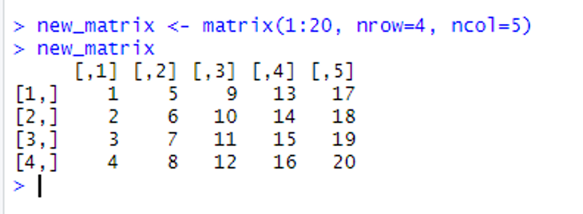
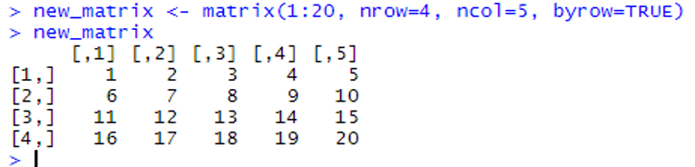
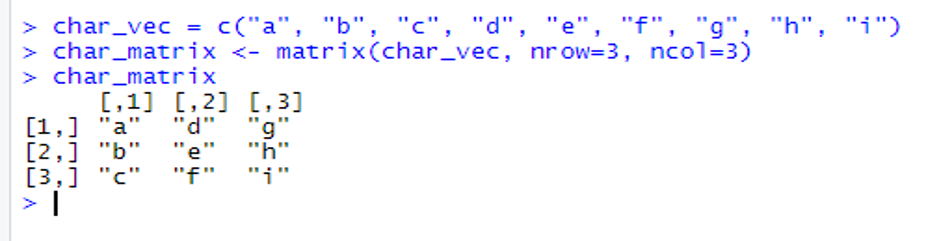
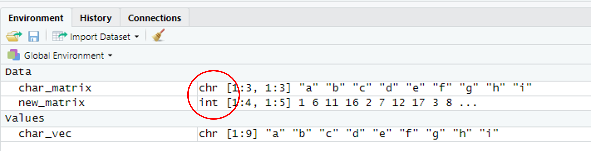
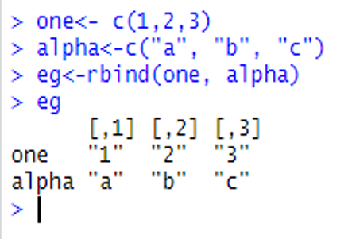
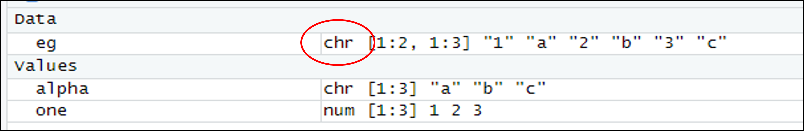

# Matricies

## Introduction 

This document is part of our "First Steps in ***R***" resources. It follows on from similar documents about vectors and functions in ***R***. It is assumed that the reader understands how to define numerical and character vectors and call a function in ***R***. If you would like to recap these topics, the documents and videos are on the MASH website.

## What is a Matrix?

In mathematics, a vector can be thought of as a single line of numbers in order, usually written in a column like so:

$$
\begin{bmatrix}
2 \\
1 \\
0 \\
7 \\
4 \\
\end{bmatrix}
$$

A matrix is a grid of numbers arranged in rows and columns like so:

$$
\begin{bmatrix}
2 & 1 & 0 & 5 \\
4 & 2 & 3 & 9 \\
0 & 8 & 8 & 1 \\
\end{bmatrix}
$$

Although there are differences between matrices in ***R*** and in mathematics, this grid arrangement is the key feature that they have in common.

## Defining a Numerical Matrix in ***R***

The following code is used to define a matrix in ***R***. We will look at the elements of the code in turn:

<code style="color: blue;">new_matrix &lt;- matrix(1:20, nrow=4, ncol=5)</code>

In ***R***, a matrix is an "object." To define any new object we begin by giving it a name. Then we use the assignment operator <code style="color: blue;">&lt;-</code> to tell ***R*** that the definition of the object is about to follow. We will call our matrix "new_matrix":

    <code style="color: blue;">new_matrix &lt;-</code>

So far, everything is the same as if we were defining a vector. Next we use the function "matrix" to tell ***R*** that the object we are defining will be a matrix.

Once we have stated which numbers we want to arrange in a matrix, we next specify how many rows and columns we want the matrix to have.

In the above example, we chose $4$ rows and $5$ columns.

The first argument of the <code style="color: blue;">matrix</code> function must be a vector. In the above example we have used the vector <code style="color: blue;">1:20</code> which is just the numbers $1$, $2$, $3$, $\ldots$ , $20$. Any vector can be used. The vector can be defined inside the <code style="color: blue;">matrix</code> function like so:

    <code style="color: blue;">new_matrix2 &lt;- matrix(c(2,3,2,3,4,6,3,7,6), nrow=3, ncol=3)</code>

In the above example the code tells ***R*** to concatenate (join together) the $9$ numbers ($2$, $3$, $2$, $3$, $4$, $6$, $3$, $7$, $6$) into a matrix with $3$ rows and $3$ columns. Alternatively, we can define the vector first and use the name of the vector as an argument like so:

    <code style="color: blue;">eg_vector &lt;- c(2,3,2,3,4,6,3,7,6)</code> 
    <code style="color: blue;">new_matrix2 &lt;- matrix(eg_vector, nrow=3, ncol=3)</code>

If we define this matrix:

    <code style="color: blue;">new_matrix &lt;- matrix(1:20, nrow=4, ncol=5)</code>

in ***R*** and then ask ***R*** to show us the matrix (by typing <code style="color: blue;">new_matrix</code>) we get the following output:

<figure>
    

        
        <figcaption style="text-align:center">
            Figure 1: <code style="color: blue;">new_matrix</code>, with the data from the vector <code style="color: blue;">1:20</code> arranged by going down the first column, then the second column and so on, is shown in the console in <b><em>RStudio</b></em>.
        </figcaption>
    

</figure>

By default ***R*** arranges the data from our vector <code style="color: blue;">1:20</code> by going down the first column, then the second column and so on. The matrix function has a fourth argument <code style="color: blue;">byrow</code> which is set to <code style="color: blue;">FALSE</code> by default. If we change <code style="color: blue;">byrow</code> to <code style="color: blue;">TRUE</code>, ***R*** starts by assigning data to the first row, then the second row and so on:

<figure>
    

        
        <figcaption style="text-align:center">
            Figure 2: <code style="color: blue;">new_matrix</code>, with the data from the vector <code style="color: blue;">1:20</code> arranged by going along the first row, the second row and so on, is shown in the console in <b><em>RStudio</b></em>.
        </figcaption>
    

</figure>

The preferred order for the arguments in the <code style="color: blue;">matrix</code> function is as shown above. The vector containing the data must **always** be the first argument. However, we can put the other arguments in any order as long as the labels <code style="color: blue;">nrow=</code>, <code style="color: blue;">ncol=</code> and <code style="color: blue;">byrow=</code> are used. Without labels, these arguments **must** be in the order shown above. Each of these three lines of code all define exactly the same matrix:

    <code style="color: blue;">new_matrix  &lt;- matrix(1:20, nrow=4, ncol=5, byrow=TRUE)</code> 
    <code style="color: blue;">new_matrix  &lt;- matrix(1:20, ncol=5, byrow=TRUE, nrow=4)</code> 
    <code style="color: blue;">new_matrix  &lt;- matrix(1:20, 4, 5, TRUE)</code>   

## Character Matrices

The previous examples discuss numerical matrices. If we define a character vector and ask ***R*** to arrange it into a matrix, the resulting matrix is called a character matrix.

For example:

    <code style="color: blue;">char_vec = c("a", "b", "c", "d", "e", "f", "g", "h", "i")</code> 
    <code style="color: blue;">char_matrix &lt;- matrix(char_vec, nrow=3, ncol=3)</code> 
    <code style="color: blue;">char_matrix</code>

produces the following:

<figure>
    

        
        <figcaption style="text-align:center">
            Figure 3: <code style="color: blue;">char_matrix</code> is shown in the console in <b><em>RStudio</b></em>.
        </figcaption>
    

</figure>

If we define <code style="color: blue;">char_matrix</code> and <code style="color: blue;">new_matrix</code> as above, we can see in the "Environment" window (top right) that the first is stored as a character matrix and the second as a numeric matrix.

<figure>
    

        
        <figcaption style="text-align:center">
            Figure 4: The top right window (the "Environment") in <b><em>RStudio</b></em> where <code style="color: blue;">char_matrix</code> is shown to be a stored as a character matrix and <code style="color: blue;">new_matrix</code> is shown to be stored as a numeric matrix.
        </figcaption>
    

</figure>

<code>chr</code> stands for character and <code>int</code> stands for integer (since all the numbers in our numeric matrix are integers).

## Combining Vectors to Make Matrices

It may be more convenient to define a vector for each row or column of a matrix and then ask ***R*** to put the vectors together into a matrix. This can be done with the <code style="color: blue;">rbind</code> and <code style="color: blue;">cbind</code> functions. <code style="color: blue;">rbind</code> combines the vectors as rows and <code style="color: blue;">cbind</code> as columns like so:

<figure>
    

        
        <figcaption style="text-align:center">
            Figure 5: The vectors <code style="color: blue;">one</code>, <code style="color: blue;">two</code> and <code style="color: blue;">three</code> are combined as rows and as columns to make matrices, outputted in the console in <b><em>RStudio</b></em>.
        </figcaption>
    

</figure>

## Combining Numeric and Character Vectors

Numeric and character vectors can be combined to make a matrix using <code style="color: blue;">rbind</code> or <code style="color: blue;">cbind</code> like so:

<figure>
    

        
        <figcaption style="text-align:center">
            Figure 6: The vectors <code style="color: blue;">one</code> and <code style="color: blue;">alpha</code> are combined as rows to make the matrix <code style="color: blue;">eg</code>, outputted in the console in <b><em>RStudio</b></em>.
        </figcaption>
    

</figure>

But if we check how ***R*** has stored this matrix, we will see that it is a character matrix:

<figure>
    

        
        <figcaption style="text-align:center">
            Figure 7: The top right window (the "Environment") in <b><em>RStudio</b></em> where <code style="color: blue;">eg</code> is shown to be stored as a character matrix.
        </figcaption>
    

</figure>

This means that ***R*** is now classifying the first row of the matrix as characters and not numbers. Matrices can only have one data type, and when we combine a character vector and a numeric vector, the numeric data is 'coerced' to become characters. If we want a row (or column) of numerical data and another with data stored as characters, we need to use a data frame. Data frames are dealt with in other documents in this series which can be found on the MASH website.

## Exercise

In ***RStudio***, define:

1. A numerical matrix ordered by columns
2. A numerical matrix ordered by rows
3. A character matrix
4. Three numerical vectors of length $5$ called <code style="color: blue;">a</code>, <code style="color: blue;">b</code> and <code style="color: blue;">c</code>
5. A matrix which has vectors <code style="color: blue;">a</code>, <code style="color: blue;">b</code> and <code style="color: blue;">c</code> as rows
6. A matrix which has vectors <code style="color: blue;">a</code>, <code style="color: blue;">b</code> and <code style="color: blue;">c</code> as columns

### Solutions

Solutions

1. First let's create a numerical vector of random integers using the <code style="color: blue;">sample()</code> command. The following creates a vector of random integers between $0$ and $9$ of length $12$:  
<code style="color: blue;">&gt; num_vect1 &lt;- sample(0:9, 12,replace=TRUE)</code>  
<code style="color: blue;">&gt; num_vect1</code>  
<code> [1] 1 6 1 1 7 5 3 2 7 5 9 0</code>   
Now create a matrix ordered by columns (remember the default is by columns):  
<code style="color: blue;">&gt; num_mat_col &lt;- matrix(num_vect1,nrow=3, ncol=4)</code>    
<code style="color: blue;">&gt; num_mat_col</code>  
<code>     [,1] [,2] [,3] [,4]</code>  
<code>[1,]    1    1    3    5</code>  
<code>[2,]    6    7    2    9</code>  
<code>[3,]    1    5    7    0</code>

2. Now create a matrix ordered by rows:  
<code style="color: blue;">&gt; num_mat_row &lt;- matrix(num_vect1,nrow=3, ncol=4, byrow=TRUE)</code>    
<code style="color: blue;">&gt; num_mat_row</code>  
<code>     [,1] [,2] [,3] [,4]</code>  
<code>[1,]    1    6    1    1</code>  
<code>[2,]    7    5    3    2</code>  
<code>[3,]    7    5    9    0</code>  

3. To create a sequential vector of letters, we can use either <code style="color: blue;">letters</code> or <code style="color: blue;">LETTERS</code> depending on whether you want lowercase or capitals. The following creates a character vector with the first $12$ letters of the alphabet:  
<code style="color: blue;">&gt; char_vect &lt;- letters[1:12]</code>  
You can also take a random sample of letters of the alphabet using the <code style="color: blue;">sample()</code> function:  
<code style="color: blue;">&gt; char_vect &lt;- sample(1etters[1:12],12, replace=TRUE)</code>  
<code style="color: blue;">&gt; char_vect</code>    
<code> [1] "d" "a" "g" "d" "b" "f" "d" "f" "f" "b" "f" "i"</code>  
The following uses the character vector that has been created to create a character matrix:  
<code style="color: blue;">&gt; matrix_char &lt;- matrix(char_vect,3,4)</code>        
<code style="color: blue;">&gt; matrix_char</code>    
<code>     [,1] [,2] [,3] [,4]</code>      
<code>[1,] "d"  "d"  "d"  "b" </code>    
<code>[2,] "a"  "b"  "f"  "f" </code>    
<code>[3,] "g"  "f"  "f"  "i" </code>   
Alternatively, you can pick the character strings for your matrix by hand:
<code style="color: blue;">char_vect &lt;- c("first word", "second word", ...)</code>

4. Now to create three vectors:  
<code style="color: blue;">&gt; a &lt;- sample(0:9,5,replace=TRUE)</code>  
<code style="color: blue;">&gt; b &lt;- sample(0:9,5,replace=TRUE)</code>  
<code style="color: blue;">&gt; c &lt;- sample(0:9,5,replace=TRUE)</code>  
<code style="color: blue;">&gt; a</code>  
<code>[1] 3 7 8 9 7</code>  
<code style="color: blue;">&gt; b</code>  
<code>[1] 7 2 9 7 3</code>  
<code style="color: blue;">&gt; c</code>  
<code>[1] 3 8 9 4 8</code>  
(Again, these vectors have been produced by picking numbers between $0$ and $9$ at random. You don't have to use the same method here, any numbers will do in your vectors.)

5. <code style="color: blue;">&gt; row_matrix &lt;- rbind(a,b,c)</code>    
<code style="color: blue;">&gt; row_matrix</code>   
<code>  [,1] [,2] [,3] [,4] [,5]</code>     
<code>a    3    7    8    9    7</code>     
<code>b    7    2    9    7    3</code>     
<code>c    3    8    9    4    8</code>  

6. <code style="color: blue;">&gt; col_matrix &lt;- cbind(a,b,c)</code>     
<code style="color: blue;">&gt; col_matrix</code>     
<code>     a b c</code>        
<code>[1,] 3 7 3</code>       
<code>[2,] 7 2 8</code>       
<code>[3,] 8 9 9</code>   
<code>[4,] 9 7 4</code>  
<code>[5,] 7 3 8</code>
    
<\details>