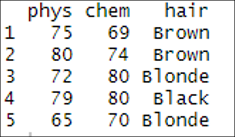

# Dataframes

## Introduction 

This document is part of our "First Steps in ***R***" resources. It follows on from similar documents about vectors, matrices and functions in ***R***. It is assumed that the reader understands how to define vectors and matrices and call a function in ***R***. If you would like to recap these topics, the documents and videos are on the MASH website.

## What is a Data Frame?

A data frame is the name given in ***R*** to a very common way of setting out data. The sampling units are arranged in rows and the variables in columns like so:

|  | Physics score (%) | Chemistry score (%) | Hair Colour |
| :--- | :---: | :---: | :---: |
| Alfred | 75 | 69 | Brown |
| Beatrice | 80 | 74 | Brown |
| Carl | 72 | 80 | Blonde |
| Daphne | 79 | 80 | Black |
| Earl | 65 | 70 | Blonde |

This data frame records the scores in Physics and Chemistry along with the hair colour for five (fictional) people.

## Defining a Data Frame in ***R***

Unlike a matrix, a data frame in ***R*** can contain character and numeric data in different columns. However, each column must have either character or numeric data only.

A data frame is an object so creating one in ***R*** is similar to creating a vector or matrix. In this case we use the function <code style="color: blue;">data.frame</code>. The <code style="color: blue;">data.frame</code> function takes vectors as arguments. These vectors form the columns of the data frame and the names of the vectors become the names of the columns. Remember, the columns in the data frame represent the variables, thus each vector contains the data for a single variable.

The following code defines a vector for each variable in the table above, combines the three vectors into a data frame and asks ***R*** to show the data frame.

    <code style="color: blue;">phys &lt;- c(75,80,72,79,65)</code> 
    <code style="color: blue;">chem &lt;- c(69,74,80,80,70)</code> 
    <code style="color: blue;">hair &lt;- c("Brown", "Brown", "Blonde", "Black", "Blonde")</code> 
    <code style="color: blue;">eg_frame &lt;- data.frame(phys, chem, hair)</code> 
    <code style="color: blue;">eg_frame</code>

This is the result when we type this code into the console:

<figure>
    

        
        <figcaption style="text-align:center">
            Figure 1: The vectors <code style="color: blue;">phys</code>, <code style="color: blue;">chem</code> and <code style="color: blue;">hair</code> are combined to make the data frame <code style="color: blue;">eg_frame</code>, outputted in the console in <b><em>RStudio</b></em>.
        </figcaption>
    

</figure>

## Setting the Row Names

If we also want to record the names of the people in our survey, we could just add in another column with their names like so:

<figure>
    

        
        <figcaption style="text-align:center">
            Figure 2: Another column, <code style="color: blue;">people</code>, is added to the data frame <code style="color: blue;">eg_frame</code>, outputted in the console in <b><em>RStudio</b></em>.
        </figcaption>
    

</figure>

But here, ***R*** sees the <code style="color: blue;">people</code> column as another variable we have recorded. If we want to tell ***R*** that this column is special because it contains the names of our sampling units we need to label it using <code style="color: blue;">row.names</code>.

We can do this in the definition of the data frame like so:

    <code style="color: blue;">eg_frame &lt;- data.frame(phys, chem, hair, row.names = people)</code>

or we can define the data frame as before and then use <code style="color: blue;">row.names</code> as a function like so:

    <code style="color: blue;">eg_frame &lt;- data.frame(phys, chem, hair)</code> 
    <code style="color: blue;">row.names(eg_frame) &lt;- c("Alfred", "Beatrice", "Carl", "Daphne", "Earl")</code>

With row names added by either of these methods, the data frame looks like this:

<figure>
    

        
        <figcaption style="text-align:center">
            Figure 3: Row names are added to the data frame <code style="color: blue;">eg_frame</code>, outputted in the console in <b><em>RStudio</b></em>.
        </figcaption>
    

</figure>

## Adding Extra Columns

For the data frame above we can add a new column like so:

    <code style="color: blue;">biology_scores &lt;- c(80, 69, 71, 72, 75)</code> 
    <code style="color: blue;">eg_frame$bio &lt;- biology_scores</code>

    

The first line defines a new vector called <code style="color: blue;">biology_scores</code> which contains the data we want to add to our data frame. The second line uses <code style="color: blue;">$</code> to define a new column within the <code style="color: blue;">eg_frame</code> data frame called <code style="color: blue;">bio</code>. This new column is then assigned the values from the vector <code style="color: blue;">biology_scores</code>.

Once the new column has been added, the data frame looks like this:

<figure>
    

        
        <figcaption style="text-align:center">
            Figure 4: A new column, <code style="color: blue;">bio</code>, is added to the <code style="color: blue;">eg_frame</code> data frame, outputted in the console in <b><em>RStudio</b></em>.
        </figcaption>
    

</figure>  

In general, to add a new column, we need code along these lines:

    <code style="color: blue;">Name of data frame $ name of new column &lt;- vector containing data for the new column</code>

## Exercise

1\. Create a data frame in ***R*** to record what you had for breakfast and how long it took you to travel to work/lectures each day last week (you can make up this data if you neglected to keep records). Set the row names as the days of the week when defining the data frame.  
2\. Record how long it took you to get home each day in a numeric vector (again, fictional data is acceptable). Add this vector to your data frame as a new column.  
3\. Create a data frame in ***R*** containing the numbers in this table  

| Team 1 Score | Team 2 Score |
| :---: | :---: |
| 2 | 1 |
| 1 | 1 |
| 3 | 2 |
| 2 | 4 |
| 1 | 3 |

4\. Create a character vector containing the words <code style="color: blue;">game1</code>, <code style="color: blue;">game2</code>, <code style="color: blue;">game3</code>, <code style="color: blue;">game4</code> and <code style="color: blue;">game5</code>. Add this vector to your data frame as the row names.  

### Solutions

Solutions

    
1. <code style="color: blue;">&gt; breakfast &lt;- c("egg", "toast", "toast", "cereal", "egg")</code>    
<code style="color: blue;">&gt; am &lt;- c(20,24,18,20,22)</code>    
<code style="color: blue;">&gt; days &lt;- c("Mon", "Tues", "Wed", "Thur", "Fri")</code>    
<code style="color: blue;">&gt; Mornings &lt;- data.frame(breakfast,am,row.names=days)</code>    
<code style="color: blue;">&gt; Mornings</code>  
<code>     breakfast am</code>  
<code>Mon        egg 20</code>  
<code>Tues     toast 24</code>  
<code>Wed      toast 18</code>  
<code>Thur    cereal 20</code>  
<code>Fri        egg 22</code>

2. <code style="color: blue;">&gt; pm &lt;- c(23,26,24,28,20)</code>  
<code style="color: blue;">&gt; Mornings$pm &lt;- pm</code>  
<code style="color: blue;">&gt; Mornings</code>  
<code>     breakfast am pm</code>  
<code>Mon        egg 20 23</code>  
<code>Tues     toast 24 26</code>  
<code>Wed      toast 18 24</code>  
<code>Thur    cereal 20 28</code>  
<code>Fri        egg 22 20</code>  

3. <code style="color: blue;">&gt; Team1Score &lt;- c(2,1,3,2,1)</code>  
<code style="color: blue;">&gt; Team2Score &lt;- c(1,1,2,4,3)</code>  
<code style="color: blue;">&gt; Scores &lt;- data.frame(Team1Score,Team2Score)</code> 

4. <code style="color: blue;">&gt; Games &lt;- c("game1", "game2", "game3", "game4", "game5")</code>  
<code style="color: blue;">&gt; row.names(Scores) &lt;- Games</code>  
<code style="color: blue;">&gt; Scores</code>  
<code>      Team1Score Team2Score</code>  
<code>game1          2          1</code>  
<code>game2          1          1</code>  
<code>game3          3          2</code>  
<code>game4          2          4</code>  
<code>game5          1          3</code>

