# Exploring Data

## Introduction 

This document is part of our "First Steps in ***R***" resources. It is assumed that the reader understands the idea of an object, a function and a package in ***R***. If you would like to recap these topics, the documents and videos are on the MASH website.

## Built-in Datasets

When ***R*** and ***RStudio*** are first installed, several useful packages are installed by default. Two packages in particular contain datasets which are often used for exercises while learning ***R***. The "datasets" package containing $104$ datasets is one that is already loaded. This means that all of its datasets are available immediately. To view information on the <code style="color: blue;">datasets</code> package type the following into the ***R*** console:

    <code style="color: blue;">library(help="datasets")</code>

This will give you brief details of the datasets including the name of each and a short description.

The command

    <code style="color: blue;">data()</code>

will produce a list of the datasets in the <code style="color: blue;">datasets</code> package.

A second useful package, "MASS", contains $87$ datasets. It is not loaded by default so to access its datasets we must first load the package using the command

    <code style="color: blue;">library(MASS)</code>

## Viewing a Dataset

"mtcars" is a dataset contained in the <code style="color: blue;">datasets</code> package. We will use this dataset as an example for the rest of this document. Like other datasets in the above packages, it is stored as a data frame in ***R***. Therefore we can view the data by simply typing

    <code style="color: blue;">mtcars</code>

into the console.

<figure>
    

        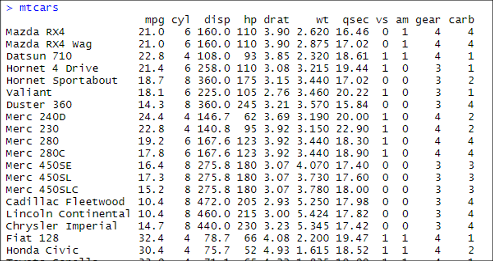
        <figcaption style="text-align:center">
            Figure 1: The <code style="color: blue;">mtcars</code> data frame is shown in the console in <b><em>RStudio</b></em>.
        </figcaption>
    

</figure>

We can find the details of what data is collected and how it is recorded using 

    <code style="color: blue;">?mtcars</code>

The "Help" window then shows us the following:

<figure>
    

        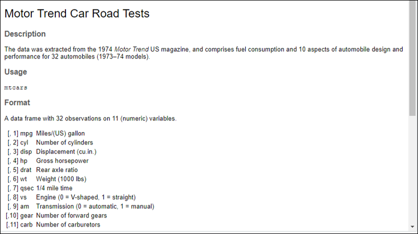
        <figcaption style="text-align:center">
            Figure 2: The "Help" tab of the bottom right window in <b><em>RStudio</b></em> when <code style="color: blue;">?mtcars</code> is typed into the console.
        </figcaption>
    

</figure>

If we want to access one variable from a dataset, we can use "\$". For example,

    <code style="color: blue;">mtcars$cyl</code>

    
tells ***R*** to look at the <code style="color: blue;">mtcars</code> data frame and then find the variable labelled "cyl".

<figure>
    

        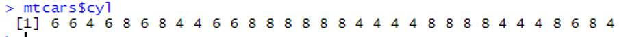
        <figcaption style="text-align:center">
            Figure 3: The data in the <code style="color: blue;">cyl</code> column of the <code style="color: blue;">mtcars</code> data frame is shown in the console in <b><em>RStudio</b></em>.
        </figcaption>
    

</figure>

## Attaching the Dataset

If we are going to work with a dataset a lot we can use the "attach" command like so

    <code style="color: blue;">attach(mtcars)</code>

Once a dataset is attached, the variables can be accessed without needing to use the <code style="color: blue;">mtcars$</code> prefix:

<figure>
    

        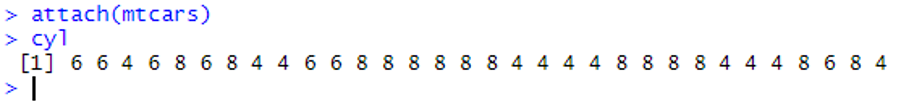
        <figcaption style="text-align:center">
            Figure 4: By attaching the <code style="color: blue;">mtcars</code> dataset, the data in the <code style="color: blue;">cyl</code> column of the <code style="color: blue;">mtcars</code> data frame is shown in the console in <b><em>RStudio</b></em>.
        </figcaption>
    

</figure>

Once you have finished working with the dataset, it is good practice to "detach" like so:

    <code style="color: blue;">detach(mtcars)</code>

## Functions For Getting to Know a Dataset

We can display a full dataset by simply typing the name of the data frame in which it is stored. However, a dataset may be too large to get a feel for the data this way. The following functions are useful for getting to know a dataset:

    <code style="color: blue;">names()</code>

gives a list of all the column names in the data frame.

<figure>
    

        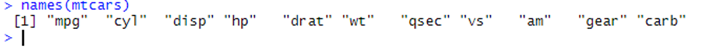
        <figcaption style="text-align:center">
            Figure 5: A list of all the column names of the <code style="color: blue;">mtcars</code> data frame is shown in the console in <b><em>RStudio</b></em>.
        </figcaption>
    

</figure>

    <code style="color: blue;">dim()</code>

gives the number of rows and columns (in that order).

<figure>
    

        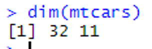
        <figcaption style="text-align:center">
            Figure 6: The number of rows and columns of the <code style="color: blue;">mtcars</code> data frame is outputted in the console in <b><em>RStudio</b></em>.
        </figcaption>
    

</figure>

In this example you can see that there are $32$ rows and $11$ variables in the data frame.

<code style="color: blue;">nrow()</code> and <code style="color: blue;">ncol()</code> can also be used for just the numbers of rows and/or columns.

    <code style="color: blue;">head()</code>

gives the first few rows of the data frame.

<figure>
    

        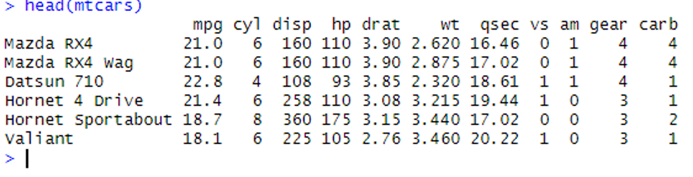
        <figcaption style="text-align:center">
            Figure 7: The first six rows of the <code style="color: blue;">mtcars</code> data frame are outputted in the console in <b><em>RStudio</b></em>.
        </figcaption>
    

</figure>

<code style="color: blue;">tail()</code> is similar to <code style="color: blue;">head()</code> but gives the last few rows.

    <code style="color: blue;">str()</code>

stands for "structure". This gives the number of observations and variables (rows and columns) followed by the name, data type of each column (numerical vector, character vector, logical vector or factor) and the first few entries in each variable:

<figure>
    

        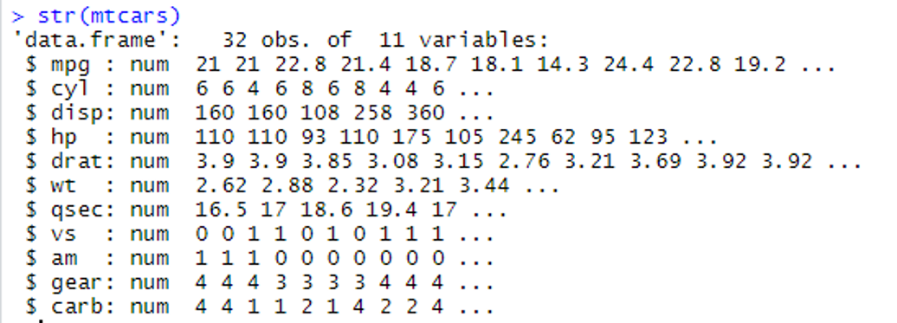
        <figcaption style="text-align:center">
            Figure 8: The structure of the <code style="color: blue;">mtcars</code> data frame is detailed in the console in <b><em>RStudio</b></em>.
        </figcaption>
    

</figure>

"num" is short for numerical. All the variables in this particular data frame happen to be numerical vectors.

    <code style="color: blue;">summary()</code>

gives a summary of each variable in the dataset.

<figure>
    

        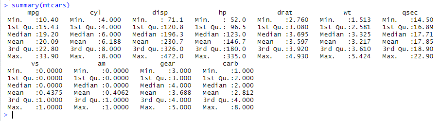
        <figcaption style="text-align:center">
            Figure 9: A summary of each variable in the<code style="color: blue;">mtcars</code> dataset is outputted in the console in <b><em>RStudio</b></em>.
        </figcaption>
    

</figure>

A column which stores a numeric vector gets summarised as above. A column which is stored in ***R*** as a factor is summarised with how many times each level appears in the column. To see this try investigating the dataset "esoph" which is part of the <code style="color: blue;">dataset</code> package. Hint: type <code style="color: blue;">?esoph</code> to see what data are stored in the dataset then <code style="color: blue;">str(esoph)</code> to see which columns are numeric vectors and which are factors. Finally type <code style="color: blue;">summary(esoph)</code> to see what the summary of a factor looks like.

## Exercise

1. Use the <code style="color: blue;">data()</code> command in the console to view a list of available datasets.  
Choose a dataset from the list and find out the following information:  
a) What data are stored in the dataset  
b) How many sampling units and how many variables there are  
c) What type of variables the dataset contains (numeric, factor etc)  
d) The maximum and minimum values of any numeric variables

### Solutions 

Solutions

    
1. Initially I chose "InsectSprays".   
a) I typed <code style="color: blue;">?InsectSprays</code> and the following information was displayed in the "Help" window (bottom right):  
<figure>
    

        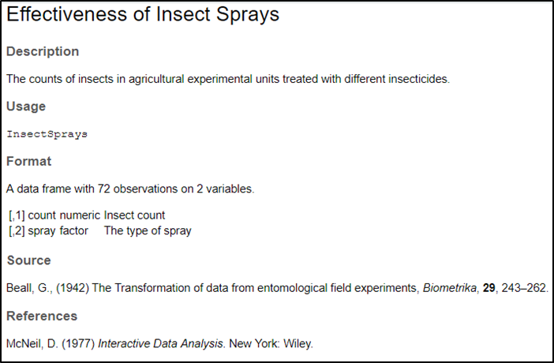
        <figcaption style="text-align:center">
            Figure 10: The "Help" tab of the bottom right window in <b><em>RStudio</b></em> when <code style="color: blue;">?InsectSprays</code> is typed into the console.
        </figcaption>
    

</figure>  

b) There are two variables in the dataset and $72$ observations/sampling units.         
c) The first variable is numeric and contains the insect count. The second variable is a factor that codes for the type of insect spray that was used. At this point there is no information on the number of levels of the factor, but the usefulness of using the command <code style="color: blue;">?InsectSprays</code> is that the "Help" window gives you additional information such as the source of the dataset and a description of it.    

I then typed <code style="color: blue;">str(InsectSprays)</code> to obtain the following info in the console window, which includes information on the number of level of the factor variable.

<figure>
    

        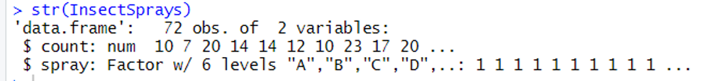
        <figcaption style="text-align:center">
            Figure 11: The structure of the <code style="color: blue;">InsectSprays</code> data frame is detailed in the console in <b><em>RStudio</b></em>.
        </figcaption>
    

</figure>

d) There is only one numeric variable in this dataset so could type <code style="color: blue;">summary(InsectSprays$count)</code> to get only the info for this variable:

<figure>
    

        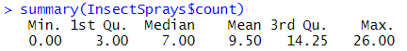
        <figcaption style="text-align:center">
            Figure 12: Some summary statistics for the "count" variable in the <code style="color: blue;">InsectSprays</code> dataset are outputted in the console in <b><em>RStudio</b></em>.
        </figcaption>
    

</figure>

Alternatively, could simply type <code style="color: blue;">summary(InsectSprays)</code> and get the information for all variables:

<figure>
    

        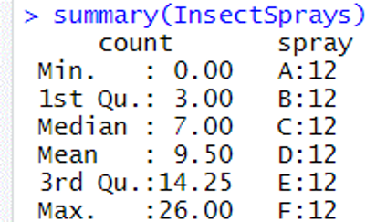
        <figcaption style="text-align:center">
            Figure 13: Some summary statistics for all variables in the <code style="color: blue;">InsectSprays</code> dataset are outputted in the console in <b><em>RStudio</b></em>.
        </figcaption>
    

</figure>
    

