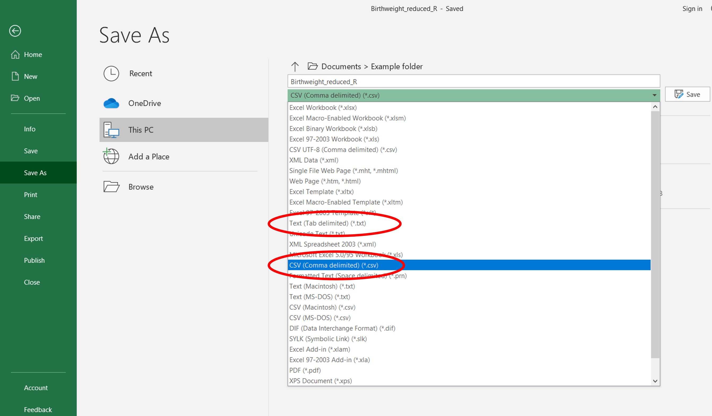
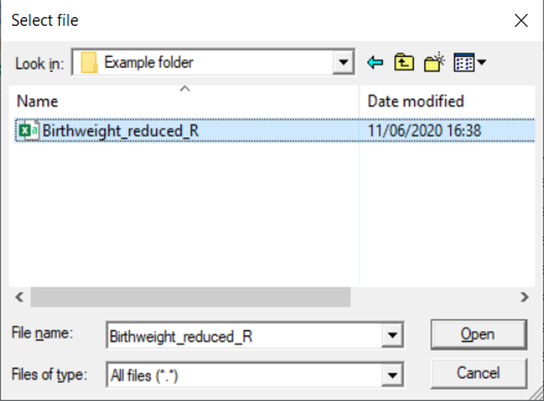
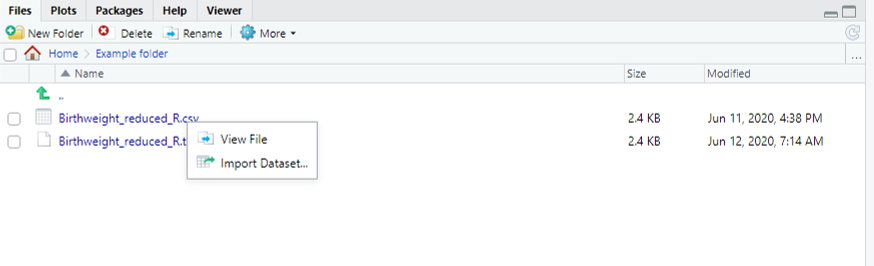
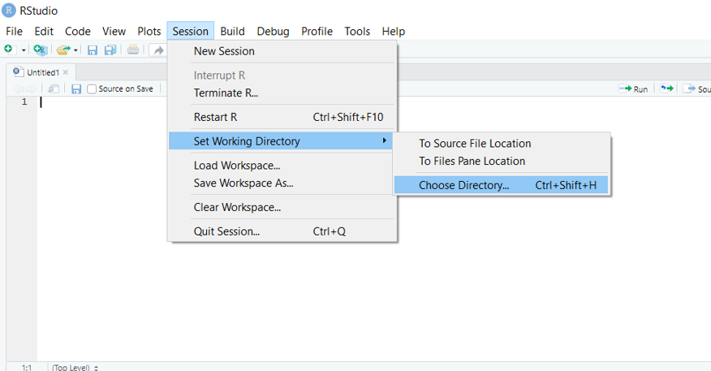
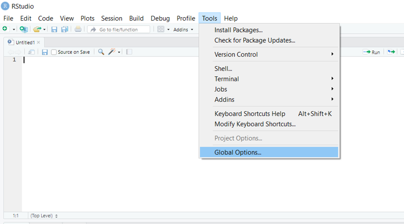
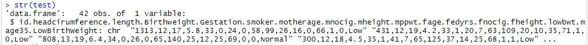

# Importing Data

## Introduction 

This document is part of our "First Steps in ***R***" resources. It is assumed that the reader understands how to define objects and call a function in ***R***. If you would like to recap these topics, the documents and videos are on the MASH website.

This document provides a guide to some of the ways to import a dataset to ***R***. It is by no means exhaustive! Users who are new to ***R*** may wish to use the suggested method below and read no further.

## Preparing Data

It is sensible to ensure the data is well prepared to avoid any issues with reading data into ***R***.

In this document, we will be reading data from an Excel file. Before importing the data to ***R***, we must make sure that it is recorded in a way which will make it easy for ***R*** to read.

Here are some useful practices:

- Use short names for variables and sampling units
- Avoid names with symbols such as ?, \$, \%, ^, \&, *, (, ), -, /, \#, I, [, ], \{ and \}.
- Avoid names, values and fields with blank spaces as they will be interpreted as separate variables, resulting in errors.
- Use . or _ to link words together if you need to, for example <code style="color: blue;">gene.length</code> or <code style="color: blue;">gene_length</code>.
- Do not make any comments in the Excel file. This will result in extra columns or NAs.
- Replace missing values with NA. R recognises NA as missing data but ***R*** would not recognise (for example) n/a as missing data.

## Importing the Data - Suggested Method

This section focusses on one method for importing an Excel file, which I found easy to use when getting to know ***RStudio***. You may prefer to stick to this method, at least until you are more familiar with ***R***. Data can be imported to ***R*** in various ways from various different pieces of software and other possibilities are discussed at the end of this document.

In the examples we will use the "Birthweight" dataset which can be found at <a href="https://www.sheffield.ac.uk/mash/statistics/datasets" target="_blank" title="Go to MASH">MASH</a>. The reader can follow the methods described with any Excel dataset.

Whichever file you decide to use, before importing into ***R***, save it as <code>.txt</code> (as tab-delimited text file) or <code>.csv</code> (comma delimited). To do this in Excel, just select the required file type when saving. In the examples we will use <code>.csv</code>.

<figure>
    

        
        <figcaption style="text-align:center">
            Figure 1: The <code>.txt</code> and <code>.csv</code> file type options when saving Excel files.
        </figcaption>
    

</figure>

Next, we type the following into the console:

    <code style="color: blue;">birthweight &lt;- read.csv(file.choose())</code>

This code allows us to browse for the file on the computer. The first part tells ***R*** that we are going to define a new object called "birthweight" (we could choose any name). Next we say that the definition of the object comes from the command "read.csv". This tells ***R*** to create a data frame from the <code>.csv</code> file we are about to describe. The argument of the <code style="color: blue;">read.csv</code> function is another function, "file.choose". This function will open a window which allows you to browse your folders and select the file you want. Note: the window sometimes opens **behind** the ***RStudio*** window leaving the user to wonder where on earth it is!

<figure>
    

        
        <figcaption style="text-align:center">
            Figure 2: The 'Select file' window for browsing folders and files when using the <code style="color: blue;">file.choose()</code> function as the argument of the <code style="color: blue;">read.csv</code> function in <b><em>RStudio</b></em>.
        </figcaption>
    

</figure>

Navigate to the folder where the file is, select the file and click "**Open**".

The dataset has now been imported to ***R*** as a data frame. In the example, the data frame is called <code style="color: blue;">birthweight</code>.

If the file is saved as a <code>.txt</code> instead of a <code>.csv</code> the above instructions can be followed using <code style="color: blue;">read.delim</code> in place of <code style="color: blue;">read.csv</code>.

## Typing a File Path

The file path of the file can be typed directly into the <code style="color: blue;">read.csv</code> function but you must remember:

- Put the file path in inverted commas <code style="color: blue;">"</code><code>file path...</code><code style="color: blue;">"</code>.
- Replace each "$\backslash$" with "$\backslash \backslash$".
- The name of the file must end <code>.csv</code>.

So a <code>.csv</code> file at this location:

<code>C:\Users\User Name\Documents\Example folder\Birthweight_reduced_R</code>

can be read into ***R*** as a data frame called "test" using this command:

    <code style="color: blue;">test &lt;- read.csv("C:\\Users\\User Name\\Documents\\Example folder\\Birthweight_reduced_R.csv")</code>

Note that unless the file is in the working directory (see below) the <code style="color: blue;">file.choose()</code> function is usually an easier option.

## Importing a File Using the Menus

One final method for reading a file in is to use the menus. Files with the format <code>.csv</code> can be imported from menus by using the file browser tab in the bottom right window to browse to the file you want, then click on the file name and select "**Import Dataset**":

<figure>
    

        
        <figcaption style="text-align:center">
            Figure 3: The bottom right window in <b><em>RStudio</b></em>, where files can be browsed and imported.
        </figcaption>
    

</figure>

Alternatively, you can go to **File -> Import Dataset** to import <code>.txt</code> files or to import directly from Excel or SPSS (although you may need to install extra packages).

## The Working Directory

***R*** has a location where it will save files to and import data from by default. This is referred to as the working directory. You can query what ***R*** currently considers its working directory by running the command

    <code style="color: blue;">getwd()</code>

If a file is in the working directory and saved as a <code>.csv</code> then it can be imported to ***R*** as a data frame like so:

    <code>Name of data frame here</code><code style="color: blue;">&lt;- read.csv("</code><code>Type file name here</code><code style="color: blue;">")</code>

Remember to include <code>.csv</code> in the file name. Files in this directory can be listed using the function:

    <code style="color: blue;">list.files()</code>

And the working directory can be changed like so:

    <code style="color: blue;">setwd("</code><code>Type file path here</code><code style="color: blue;">")</code>

But remember to replace "$\backslash$" with "$\backslash \backslash$" in the file path. Alternatively, the menus can be used by going to **Session -> Set Working Directory -> Choose Directory...**

<figure>
    

        
        <figcaption style="text-align:center">
            Figure 4: How to use the menus in <b><em>RStudio</b></em> to change the working directory for the rest of the session.
        </figcaption>
    

</figure>

The new working directory is now set for the rest of the session. To change the working directory permanently, go to **Tools -> Global Options...**

<figure>
    

        
        <figcaption style="text-align:center">
            Figure 5: How to use the menus in <b><em>RStudio</b></em> to change the working directory permanently.
        </figcaption>
    

</figure>

Then select a new folder as the working directory by clicking "Browse..." here:

<figure>
    

        
        <figcaption style="text-align:center">
            Figure 6: How to select a new folder as the working directory in <b><em>RStudio</b></em>.
        </figcaption>
    

</figure>

If you're going to be importing and exporting lots of data to and from a particular folder, you may like to set this folder as your working directory at the beginning of a session. If you are working on multiple projects in ***R*** you could have one folder per project and change the working directory when you start work on a different project.

## A Warning

Sometimes ***R*** will happily read data using an inappropriate function and create an object without raising an error. However, the data might be unusable. Hence, we should always check the data frame that we have created. Consider:

    <code style="color: blue;">test &lt;- read.delim("Birthweight_reduced_R.csv")</code>

Here we have asked ***R*** to read a <code>.csv</code> file but we have used <code style="color: blue;">read.delim</code> instead of <code style="color: blue;">read.csv</code>.

If we examine our data frame using

    <code style="color: blue;">head(test)</code> 
    or 
    <code style="color: blue;">str(test)</code> 
    or 
    <code style="color: blue;">summary(test)</code>

we will see we have a problem.

<figure>
    

        
        <figcaption style="text-align:center">
            Figure 7: The structure of the "test" data frame, but with the data read as if it is a list, is detailed in the console in <b><em>RStudio</b></em>.
        </figcaption>
    

</figure>

Can you see what has happened?

The <code style="color: blue;">read.delim()</code> is used for reading in data that is stored in a <code>.txt</code> file, and thus will read in the data as if it is a list.