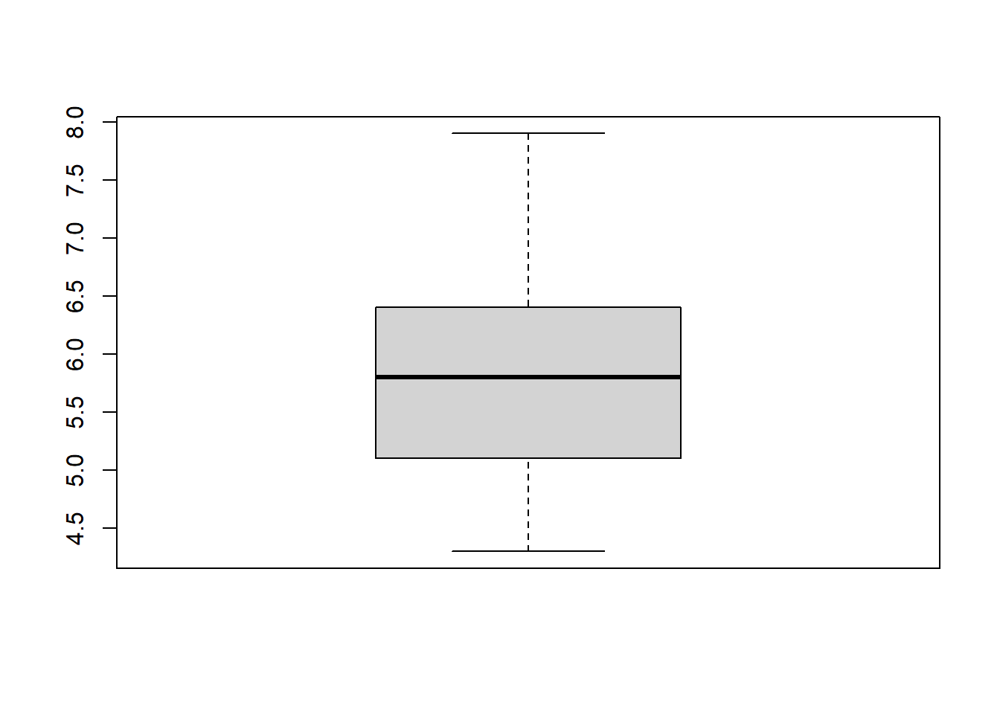
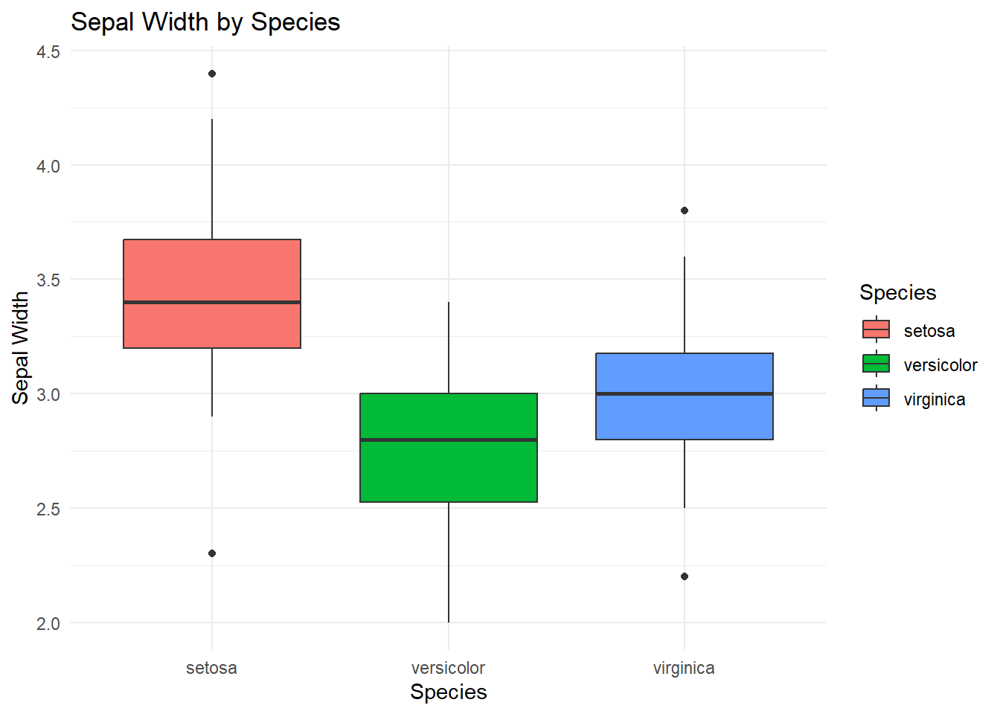

# Everything you need to know before you learn R

If you are completely new to R, you are in the right place.

Learning R can feel intimidating at first. Unlike software such as Excel and SPSS, R asks you to **type instructions** to tell the computer what you want it to do rather than clicking icons and menus.


The good news is that you do **not** need to be a programmer to learn R. You just need to learn a few basic ideas, practise them, and gradually build up your understanding.

This document is not intended to teach you R - rather, it should help you get started and highlight the key concepts to know before you try to learn R.

By the end, you should understand:

-   What R is
-   The difference between R and Rstudio
-   Some advantages and disadvantages of R versus other software
-   Main parts of the RStudio interface
-   How to begin coding in R
-   Where to find help and learning materials
-   How to continue learning R independently

::: {.success-box}
👍 **The most important thing to remember:** You do not need to understand everything before you start. Learning R is a process.
:::

## What is R?

R is a **programming language**. That means that instead of telling R what to do by clicking buttons in a menu, you generally type instructions.

For example, you can ask R to calculate 2+2 


``` r
2 + 2
```
and it will return:

```
#> [1] 4
```

R is widely used for statistics, data analysis and data visualisation. It is used by students, researchers, universities, governments, businesses and many other organisations.

R is especially useful when you need to:

-   Work with data
-   Perform calculations
-   Carry out statistical analyses
-   Create graphs and visualisations
-   Manipulate datasets

### What is RStudio?

You will often hear people talk about **R and RStudio** as though they are the same thing.

They are not.

**R is the programming language itself.** It is the thing that actually performs your calculations, analyses and commands.

**RStudio is an Integrated Development Environment (IDE) for R.** A fancy term for a user dashboard. It provides a convenient interface for working with R.

::: {.info-box}
💡 **Think of it this way:**

If R is the engine, RStudio is the dashboard that makes the engine easier to use.
:::

You can use R without RStudio, but RStudio provides a much more convenient environment for writing, running and organising R code.

When you are getting started, you will normally install **both R and RStudio**.

### Why learn R?

There are lots of reasons to learn R.

#### It's free!

One of the biggest advantages of R is that it is **free**. You do not need to buy a licence to continue using R after you graduate and there are no limits to how many devices you install it on.

#### It's flexible!

R can be used for an enormous range of tasks from calculating statistics, plotting data, statistical analysis, hypothesis tests, regression, automating tasks, writing reports and much more.

#### It's widely used!

R is widely used in scientific research and academia, as well as industry. R has an enormous library of **packages** to help you perform even quite specific tasks.

Packages are collections of additional functions, data and other resources that extend what R can do.

::: {.info-box}
ℹ️ R can do a huge amount. And if it cannot already do something you need, there is often a package that can help — or you can potentially create your own solution.
:::

### The downsides of R

R is powerful, but there are some things that can make it difficult to use when you first start. The main thing being that you have to interact with it as a programming language.


If you are used to software where you select options from menus, R may initially feel unfamiliar and there will be quite a lot to learn.

Before being proficient in R, you will need to learn:

-   How R understands commands
-   What objects are
-   How functions work
-   How to structure your code
-   How to find and fix errors

This can feel daunting at first but is **completely normal**.

The first few sessions of learning R are often the hardest because you are learning a new way of communicating with a computer, but with a bit of practise, you'll soon get the hang of it. 

In software such as Excel, to plot a graph you might:

1.  select some cells;
2.  click *insert*;
3.  select the chart type you want;
4.  click OK.

In R, you might instead type something like:


``` r
boxplot(my_data)
```

and get a plot such as 



## Installing R and RStudio

The [University of Sheffield MASH R resources page](https://sheffield.ac.uk/mash/stats-resources/r) contains a guide to downloading and setting up both [R](https://cran.r-project.org/) and [RStudio](https://posit.co/products/open-source/rstudio).

Alternatively, go to both the [R](https://cran.r-project.org/) and [RStudio](https://posit.co/products/open-source/rstudio) webpages and download the appropriate version for your device.

::: {.warning-box}
⚠️ It is important that you download **both** R and RStudio.
:::


## Getting to know RStudio

When you open RStudio, you will probably see several different sections or **panes**.

The exact arrangement can vary depending on your version and settings.

A common layout contains four main panes:

1.  (Top-left) **Source**
2.  (Bottom-left) **Console**
3.  (Top-right) **Environment / History**
4.  (Bottom-left) **Files / Plots / Packages / Help**

### 1. Source

The **Source** pane is where you can write, edit and save your code. If it is the first time opening Rstudio, the **Source** pane may not appear until you click the following.

File \> New File \> R Script

The **Source pane** is where you should normally develop your analysis. The saved code is referred to as a script and has the file extension `.R`. These files can be reopened and worked on at any time.

### 2. Console

The **Console** is where R receives and executes commands.

You can type directly into it. The result will appear underneath. Unlike an R script, the **Console** is temporary and anything you type into it is not saved. The **Console** is particularly useful for:

-   Trying out commands
-   Testing ideas
-   Checking the result of a function
-   Troubleshooting

> Tip: you can press the **Up** key with your cursor in the Console to quickly cycle through commands you have typed recently\*\*

### 3. Environment / History

The **Environment** pane shows objects that currently exist in your R session.

For example, if you run the code:


``` r
student_scores <- c(65, 72, 81, 69, 88)
```

the object `student_scores` will appear in the **Environment**. *We'll talk more about objects later*.

The **Environment** therefore gives you a useful overview of the objects you have created.

There are other tabs within this pane, the next most useful being the **History** tab which shows all the commands that you have previously entered.

This can be useful when you are trying to remember something you did earlier in your session.

### 4. Files / Plots / Packages / Help

The last window contains several tabs including **Files, Plots, Packages and Help**.

The **Files** tab allows you to navigate through folders on your computer (see **Working Directories** for more detail).

**Plots** displays graphs that you create in R.

**Packages** allows you to see packages that are installed in your R session.

**Help** displays R's documentation when you request it using the `?` command (see [Errors](#Errors) for further help).

The following table summarises the pane functions.

| Window          | What it does                       |
|-----------------|------------------------------------|
| **Source**      | Write and edit R scripts           |
| **Console**     | Run R commands                     |
| **Environment** | View objects currently stored in R |
| **History**     | View previously entered commands   |
| **Files**       | Navigate through files and folders |
| **Plots**       | View graphs                        |
| **Packages**    | Install and manage packages        |
| **Help**        | Access R documentation             |

### Working directories

One concept that often causes confusion when you first start using R is the **working directory**.

The **working directory** is the folder that R is currently using as its default location for reading and writing files.

You can find your current working directory by running:


``` r
getwd()
```

`getwd()` means **get working directory**.

You can change the working directory using `setwd()` and the path to your desired folder. For example:


``` r
setwd("C:/Users/YourName/Documents/R")
```

The exact path will depend on your computer.

::: {.info-box}
ℹ️ You do not necessarily need to use `setwd()`. Instead, in the **Files** tab, click **...** on the right-hand side, click through the file explorer to find the folder you want then click **Open**. Click the cog symbol titled **More** then Select **Set as Working Directory**.
:::

## Learning how to write code

There are a few things that are worth understanding right at the beginning.

R is primarily controlled by typing commands. You can think of each line of R code as an instruction.

For example, to find the mean of the `student_scores` given above  you'd type:


``` r
mean(student_scores)
```

It is very important before learning R to realise that **you do not have to memorise everything.**

One of the most important skills in R is knowing how to find information. It is unlikely that you will remember the code for everything you want to do.

That is normal.

Learning R is not about memorising an enormous list of commands. It is about learning enough of the language that you can understand, debug (fix) and build code.

The [University of Sheffield MASH R resources page](https://sheffield.ac.uk/mash/stats-resources/r#First-steps) provides first steps in R.

These first steps will guide you through:

-   Installing R
-   Downloading RStudio
-   Interacting with R
-   Understanding objects and functions
-   Working with vectors
-   Getting started with data
-   Installing packages

These are a good place to get started!

### What is a command?

A **command** is an instruction that you give to R.

To run a command in the **Console** you simply type your command and press **Enter**.

To run a command in the **Source** pane (script) there are two ways:

-   Highlight the line(s) of code and press **Ctrl + Enter** on your keyboard or the **Run** key in the top right of the Source pane.

-   Put your cursor on the line of code and press **Ctrl + Enter**. This also moves the cursor to the next line so you can easily run the next line.

::: {.success-box}
👍 To quickly highlight your entire script click **Ctrl + A** with your cursor anywhere in the script.
:::

An example command is:


``` r
2 + 2
```

an instruction asking R to add two numbers.

Another example is:


``` r
even_numbers <- c(2, 4, 6, 8)
```

This tells R to create an *object* named `even_numbers` by combing the numbers 2,4,6 and 8. Note here, that in programming we call this a vector. Vectors are formed in R using the function `c()` where `c` stands for combine. 

You will quickly become familiar with the basic structure of R commands.

### What is a function?

A **function** is a piece of code designed to perform a particular task.

Functions are one of the most important concepts in R.

For example:


``` r
mean(c(2, 4, 6, 8))
```
gives the following output.


```
#> [1] 5
```

Here:

-   `mean` is the function;
-   `c(2, 4, 6, 8)` is the input;
-   the function calculates the mean.

Functions are generally followed by parentheses:


``` r
function_name()
```

The information that you give to a function is called an **argument**.

For example:


``` r
round(3.14159, digits = 2)
#> [1] 3.14
```

Here:

-   `round()` is the function;
-   `3.14159` is the value being rounded;
-   `digits = 2` tells R how many decimal places to use.

### Objects

Objects are another fundamental idea in R.

An object is something that R can store and work with.

For example:


``` r
age <- 21
```

Here we have created an object called `age`.

We can then ask R to show us its value:


``` r
age
#> [1] 21
```

We can also use it in another calculation:


``` r
age + 1
#> [1] 22
```

#### Assignment

The `<-` symbol is commonly used to assign a value to an object.

For example:


``` r
my_number <- 10
```

This means store the value `10` in an object called `my_number`.

Objects can contain different types of information. They do not have to contain just single numbers.

For example, an object can contain text:


``` r
student_name <- "Alex"
```

Or several numbers:


``` r
test_scores <- c(65, 72, 81, 69, 88)
```

For now, the important thing is simply to understand that R allows you to **store information in objects and then use those objects later**.

#### Naming objects

It is a good idea to give objects sensible names. When naming objects, best practices are to:

1.  Be informative about that the object represents
2.  Do not use spaces
3.  If it has multiple words in the name, separate these by underscores or capitalise each word.
4.  Do not include dots or other symbols

Good examples are:


``` r
age <- 21
average_score <- 75
TestScores <- c(65, 72, 81, 69, 88)
```

Compared with bad names:


``` r
x <- 21
average score <- 75
TEST.SCORES! <-  c(65, 72, 81, 69, 88)
```

The last two objects `average score` and `TEST.SCORES!` are so bad that they will give you the following error!


```
#> Error in parse(text = input): <text>:1:9: unexpected symbol
#> 1: average score
#>             ^
```

### Comments

You can add comments to your R code using the `#` symbol.

Anything after `#` on that line will be treated as a comment rather than R code and wont be executed when you run that line or script.

For example:


``` r
# Calculate the mean of the scores
scores <- c(1,2,3,4,5)
mean(scores)
```

Comments are useful for explaining what your code is doing.

You can also use comments to organise a script:


``` r
# -----------------------------------
# Calculate summary statistics
# -----------------------------------
mean(scores)
median(scores)
sd(scores)
```

::: {.success-box}
👍 **Good habit**

Write comments that help you — and someone else — understand what your code is doing.
:::


Keeping your code organised. As your R scripts become longer, organisation becomes increasingly important.

You can use comments and headings to divide your code into sections.

For example:


``` r
# Load packages

library(ggplot2)

# Import data

data <- read.csv("my_data.csv")

# Explore data

head(data)
summary(data)

# Analysis

mean(data$score)

# Visualisation

plot(data$score)
```

This makes your script much easier to read.

### Errors
::: {.warning-box}
⚠️ **Help! I've got an Error.**
:::

Getting errors, warnings and breaking your code are completely normal when programming - not just when you are learning it. Errors are not a sign that you are bad at coding. They are a very normal and it is likely you will see them frequently.

For example, if you type:


``` r
mean("This is not a number")
```

R will complain because it doesn't know how to take the mean of something that isn't numeric.

You may see an error message such as:

``` text
Warning message:
In mean.default("this is not a number") :
  argument is not numeric or logical: returning NA
```

The error message is actually useful. It is R trying to tell you what went wrong.


::: {.info-box}
ℹ️ **When something goes wrong:** 

1.  Do not panic
2.  Read the error message
3.  Look at the line of code that caused the problem
4.  Check your spelling
5.  Check your brackets
6.  Check your quotation marks
7.  Check whether you have created the objects you are using
8.  Search the error message if you are unsure
:::

::: {.success-box}
👍 **It is just as important to learn how to debug your code as it is to learn how to write code.**
:::

When stuck for coding solutions, experienced R users regularly:

**1. Search Online**

Often, a quick Google (or your preferred search engine) will give you the syntax you need to perform/fix what you want in R.

**2. Look at documentation**

Some of the more frequently used packages such as [ggplot2](<https://ggplot2.tidyverse.org/>) (a powerful packages for creating graphs) have very thorough documentation that can be very helpful in learning how to use it. 

**3. Use R help pages** 

R has a built-in help system. For example, if you want to find out more about the `mean()` function, you can type:


``` r
?mean
```

The Help pane in RStudio will then display information about the function. See **Getting to Know Rstudio** to find out more information about the Help pane.

R help pages can initially look intimidating. You will usually see information about:

-   What the function does.
-   How to use it.
-   The value it returns.
-   Examples of it in use.

The **Examples** section is particularly useful when you are learning.

You can often copy an example, run it yourself and then modify it.

**4. Ask peers**

In industry, academia and any other workplace it is very common to ask peers and colleagues for help with coding. Often, a solution to your problem will already exist and they may have seen it somewhere before. This is especially useful when your code is giving you errors - an extra pair of eyes always helps! In some cases, you often spot the error as your explaining your out loud to someone else. 

**5. Using AI**

It's fairly commonplace now to use AI to debug or write code for you. Whilst this can be incredible useful it should be used with caution. Generative AI has a habit of producing over complex code that, whilst looking shiny and professional, is very hard to understand, modify and fix if you don't have a good grasp on the underlying language.

Understanding the concepts of coding are fundamental in providing solutions to problems and performing novel research. The long-term benefit of learning, reading and writing code yourself far outweigh the short term benefit of generating a sophisticated analysis with no development of your understanding.

Not only this, for some university assessments, the use of AI may not be tolerated at all, so it is good to check that you are using AI in a way that is honest, fair and responsible. Thorough guidance on the use of AI at The University of  Sheffield can be found on the [StudySkills@Sheffield](https://sheffield.ac.uk/study-skills/digital/generative-ai/assessment#unfair-means) webpage. 

## MASH support

There are lots of ways to learn R, and you do not have to learn it alone. Here at MASH, we offer friendly and specialist support from workshops to 1:1 sessions to suit your needs. Here are the main ways we can support you.

### MASH workshops

MASH runs workshops covering statistics, mathematics and software skills.

R workshops are a great way to learn alongside other students and ask questions as you go.

We offer [R workshops for ultra-beginners](https://301skills.shef.ac.uk/events/284/upcoming). These are designed for people who want to learn R from the very basics, without any prior knowledge - excellent if you have never coded before.

We also have more bespoke R workshops such as 

- [MASH workshop: Using R for data visualisation](https://301skills.shef.ac.uk/events/287/upcoming) 
- [MASH workshop: Using R for hypothesis testing](https://301skills.shef.ac.uk/events/391/upcoming)
- [MASH workshop: Using R for regression](https://301skills.shef.ac.uk/events/291/upcoming)

You can find and book workshops on the [MASH workshops booking calendar](https://students.sheffield.ac.uk/mash/workshops#bookig-calendar)

### MASH online resources

The [MASH First steps in R resources](https://sheffield.ac.uk/mash/stats-resources/r#First-steps) are designed to help you get started from the beginning, providing videos and help pages for getting started with R.

### MASH 1-1 support

If you are stuck, you can also book a 1-1 appointment with MASH.

A 1:1 can be particularly useful if you have a specific question about:

-   A research problem
-   How to implement a statistical method
-   R code that is not working
-   Interpreting your output

You can book a 1-1 appointment on the [MASH statistics 1-1 appointment booking page](https://students.sheffield.ac.uk/mash/bookings/stats-support#book-here)

## Where to go next

Once you have got through the basics, there are lots of other resources you can use to continue learning.

### YaRrr! The Pirate's Guide to R

[YaRrr! The Pirate's Guide to R](https://bookdown.org/ndphillips/YaRrr/) is a clear, free online textbook.

It provides an accessible introduction to R and includes examples that you can work through yourself.

### R for Data Science
[R for Data Science](https://www.google.co.uk/books/edition/R_for_Data_Science/I6y3DQAAQBAJ?hl=en&gbpv=0) by Hadley Wickham is a great guide for importing, wrangling, manipulating and visualising data. 


### Learn R by example

[Learn R by example](https://www.learnbyexample.org/r/) is an easily to follow website organised around examples.

It covers topics ranging from basic R syntax through data structures, functions, data import, graphics and more.

### Swirl

**Swirl** is a package for learning R interactively within RStudio.

Instead of reading instructions on a webpage and then switching between your browser and RStudio, Swirl gives you interactive lessons directly in R.

Begin by installing the `swirl` package.

Type the following command into the **Console**:


``` r
install.packages("swirl")
```

Wait for the installation to finish.

Once the installation is complete, load the package:


``` r
library("swirl")
```

Then start Swirl by typing:


``` r
swirl()
```

Swirl will begin interacting with you. Simply read the instructions on the screen and enter your responses.


## Step-by-step process for learning R
> Important: There is no single "correct" way to learn R.

However, a useful approach is:

**Step 1** — Get R and RStudio installed

Make sure both are installed and that you can open RStudio.

Start with the [MASH First steps in R resources](https://sheffield.ac.uk/mash/stats-resources/r#First-steps) if you need help.

**Step 2** — Learn the basic language

Get comfortable with:


``` r
# Objects
my_number <- 10

# Vectors
my_numbers <- c(10, 20, 30, 40)

# Functions
mean(my_numbers)

# Indexing
my_numbers[1]
```

Executing `my_numbers[1]` will give the value 10, the number with *index* 1 (i.e. the 1st number) of the vector `my_numbers`. 

Knowing how to index in R is incredibly useful for removing, adding and selecting specifc rows of your data, as well as other things. It is well worth spending time to learn about it.

> Note: If you have used other programming languages before, you will be aware that 0 is usually the first index of a vector. This is different in R. Indexing starts from 1.   

**Step 3** — Practise

Do not just read R code.

- Type it
- Change it
- Break it
- Fix it

Try to predict what will happen before you run it.

**Step 4** — Work with R data sets

Once you understand the basics, start working with data. R has an amazing library of built-in real world datasets. These are nice clean examples of data that are frequently used to demonstrate visualisation and data analysis.

To access the data sets you need to install the `datasets` package using the following commands.


``` r
install.packages("datasets")
library(datasets)
```

You can then run the command


``` r
data()
```
to view a list of the datasets available. To load a dataset you simply type the dataset. For example, for the `iris` dataset you simply run:


``` r
head(iris)
#>   Sepal.Length Sepal.Width Petal.Length Petal.Width Species
#> 1          5.1         3.5          1.4         0.2  setosa
#> 2          4.9         3.0          1.4         0.2  setosa
#> 3          4.7         3.2          1.3         0.2  setosa
#> 4          4.6         3.1          1.5         0.2  setosa
#> 5          5.0         3.6          1.4         0.2  setosa
#> 6          5.4         3.9          1.7         0.4  setosa
```

**Note:** By putting `iris` in the function `head()`, R only shows us the first few rows of the data. 

Important concepts to learn with the example data are:

-   Importing data
-   Cleaning data
-   Selecting variables
-   Adding new variables
-   Plotting graphs
-   Statistical analysis


**Step 5** — Build something

The best way to learn R is to use it. Try using R for something that you actually need to do.

For example:

> "I have a dataset. Can I use R to calculate some summary statistics and make a graph?"

Maybe we wanted to create a graph showing the differences in sepal width between species in the `iris` dataset. We can make a quick plot using the following code.


``` r
boxplot(
  Sepal.Width ~ Species,
  data = iris
)
```


**Step 6** - Develop it

Once you have a minimal viable product of what you want to create, now it is time to develop your code. This could mean, making plots look better, making analysis more sophisticated, or simply organising your code better for yourself or another reader. 

For example, we might improve our code above by using the `ggplot2` package and adding in some comments for the user.


``` r
# Load in ggplot packages
library(ggplot2)

# Plot a boxplot of sepal widths coloured by iris species
ggplot(iris, aes(x = Species, y = Sepal.Width, fill = Species)) +
  geom_boxplot() +
  labs(
    title = "Sepal Width by Species",
    x = "Species",
    y = "Sepal Width"
  ) +
  theme_minimal()
```




## Final advice

When learning R, you may sometimes feel that everyone else understands it except you.

That's not true.

Even experienced R users regularly search for functions, look at documentation, make mistakes and spend time figuring out why something isn't working.

The difference is that, with practice, you gradually become better at solving those problems.

You do not need to become an expert before you can use R.

You just need to keep building your knowledge.

::: {.success-box}
👍 **Start small. Practise often. Don't be afraid of errors. Ask for help.**
:::

## Your R learning checklist

Use this checklist to keep track of your progress.

-   [ ] I understand what R is.
-   [ ] I understand the difference between R and RStudio.
-   [ ] I have installed R.
-   [ ] I have installed RStudio.
-   [ ] I can open RStudio.
-   [ ] I know where to find the [MASH First steps in R resources](https://sheffield.ac.uk/mash/stats-resources/r#First-steps) page.
-   [ ] I know what the Console is.
-   [ ] I know what an R script is.
-   [ ] I understand the difference between the Console and a script.
-   [ ] I know what a command is.
-   [ ] I know what a function is.
-   [ ] I know what an argument is.
-   [ ] I can create an object.
-   [ ] I can create a vector.
-   [ ] I can call a function.
-   [ ] I know what a package is.
-   [ ] I know the difference between installing and loading a package.
-   [ ] I know how to find help for a function.
-   [ ] I understand what a working directory is.
-   [ ] I know how to save an R script.
-   [ ] I know how to [book a MASH 1:1 appointment](https://students.sheffield.ac.uk/mash/bookings/stats-support#book-here).
-   [ ] I know how to [book a MASH R workshop](https://students.sheffield.ac.uk/mash/workshops#bookig-calendar)


## Glossary 

| Term | Brief description |
|---|---|
| **R** | A programming language used for statistics, data analysis and data visualisation. |
| **RStudio** | An Integrated Development Environment (IDE) that provides an interface for working with R. |
| **Command** | An instruction given to R to perform an action. |
| **Function** | A piece of code designed to perform a particular task. |
| **Argument** | Information supplied to a function that tells it what to work with or how to behave. |
| **Object** | Something that R can store and work with, such as a number, text or vector. |
| **Assignment** | The process of storing a value in an object, commonly using `<-`. |
| **Package** | A collection of additional functions, data and resources that extends R's capabilities. |
| **Script** | A saved file containing R code, usually with the `.R` file extension. |
| **Console** | The RStudio pane where R commands are entered and executed. |
| **Source** | The RStudio pane where you write, edit and save R scripts. |
| **Environment** | The RStudio pane showing objects currently stored in your R session. |
| **History** | An RStudio tab showing commands previously entered during your session. |
| **Working directory** | The folder R uses as its default location for reading and writing files. |
| **Comment** | Text beginning with `#` that R ignores when executing code. |
| **Debugging** | The process of finding and fixing problems in code. |
| **Error** | A message from R indicating that something has gone wrong when running code. |
| **Warning** | A message from R indicating that something may not have worked as expected. |
