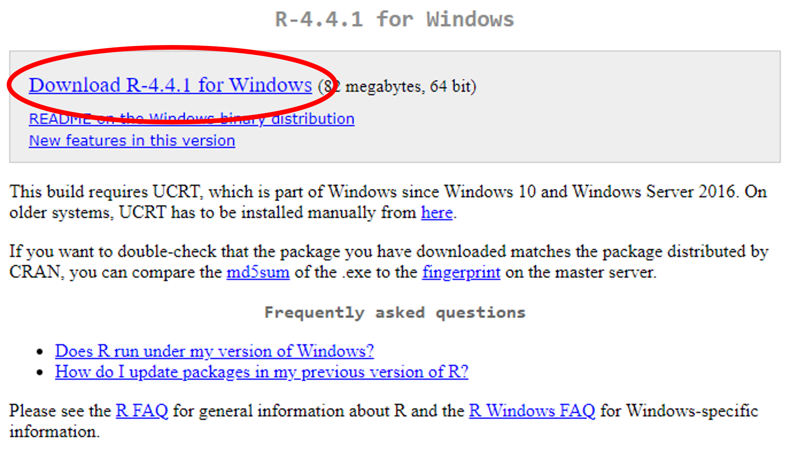
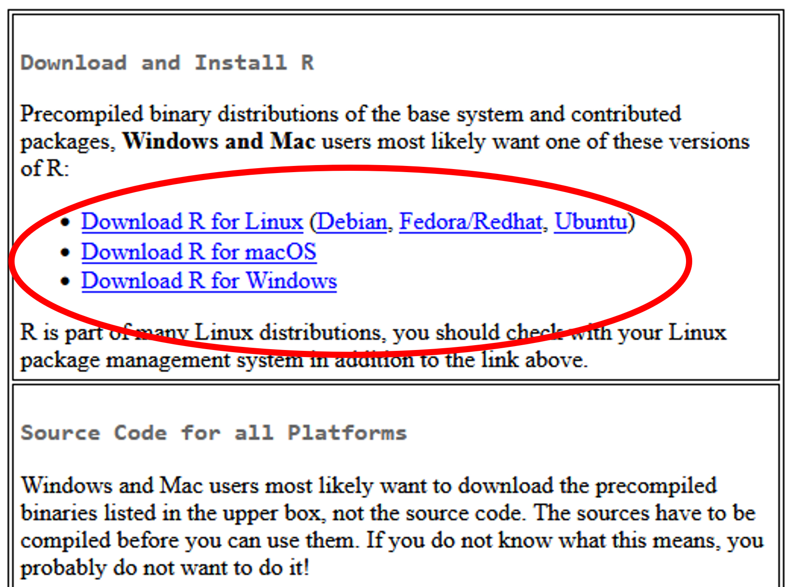
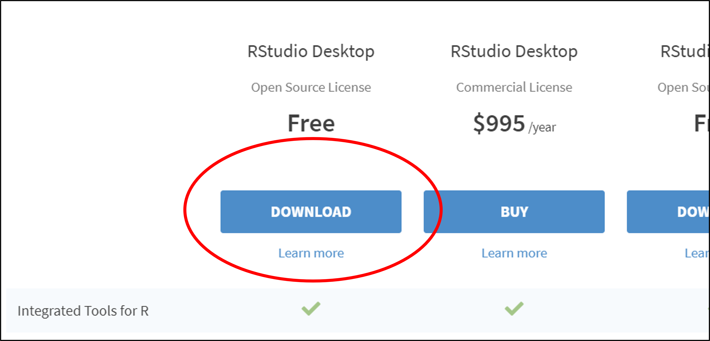

# Downloading R and RStudio

## Introduction 

---

This is the first document in our "First Steps in ***R***" series of resources.

***R*** is a programming language specifically designed for doing statistics. The ***R*** software can be downloaded on its own but it is more usual to download both ***R*** and ***RStudio***. ***RStudio*** is a more convenient way of interacting ***R***. The ***R*** *software* must be installed before ***RStudio*** will work.

## Downloading ***R*** for Windows (do this first, before downloading ***RStudio***)

***R*** can be downloaded from <a href="https://cran.r-project.org/bin/windows/base/" target="_blank" title="Go to CRAN">CRAN (the Comprehensive R Archive Network)</a>.

Click “**Download R-4.4.1 for Windows**”.

<figure>
    

        
        <figcaption style="text-align:center">
            Figure 1: The link to click to download <b><em>R</b></em> for Windows.
        </figcaption>
    

</figure>

When the file has downloaded, open it just as you would when installing any other new program.

We would recommend you agree with the default settings and perhaps consider clicking the boxes to add a desktop shortcut and a ***Quick Launch*** shortcut.

## Downloading ***R*** for other operating systems

Go to <a href="https://cran.r-project.org" target="_blank" title="Go to CRAN">CRAN (the Comprehensive R Archive Network)</a>. Select the appropriate operating system from the options given then download the latest release from the following page.

<figure>
    

        
        <figcaption style="text-align:center">
            Figure 2: The links to click to download <b><em>R</b></em> for other operating systems.
        </figcaption>
    

</figure>

## Downloading ***RStudio*** (you will need to download ***R*** first to enable ***RStudio*** to work)

Go to <a href="https://rstudio.com/products/rstudio/download" target="_blank" title="Go to RStudio">R Studio</a>. 
 
Scroll down a little and choose the free version of ***RStudio*** and click "**Download**."

<figure>
    

        
        <figcaption style="text-align:center">
            Figure 3: The button to click to download <b><em>RStudio</b></em>.
        </figcaption>
    

</figure>

Click "**Download** ***RStudio*** **for Windows**" (or select your operating system from the list a little further down).

Again, open the file just as you would when installing any other new program and select the default options.
