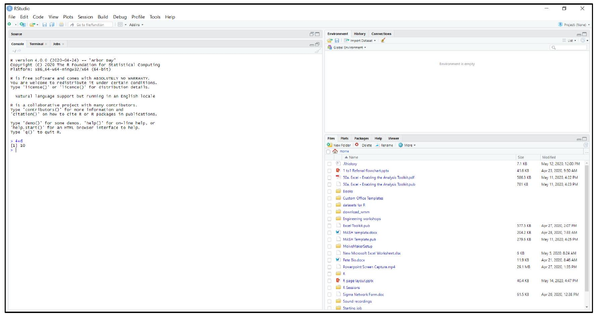
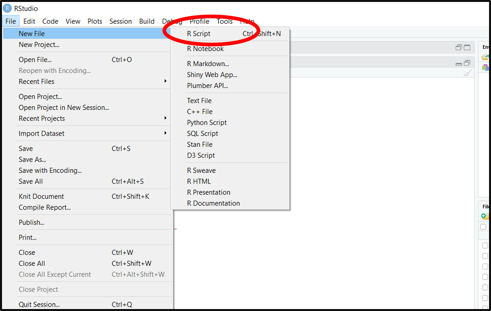
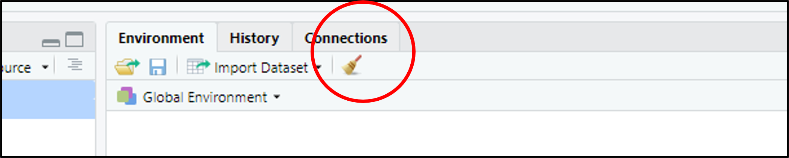

# First interactions with R and RStudio

## Opening R

If you open the R software you will get a window in which you can type code. This is the **Console** (more on this later). It is possible to do all your coding in this Console but RStudio is much more friendly to use.  Because of its ease of use, once you've used RStudio, you will probably find you never open R again! All of the materials in this book use RStudio for this reason.

## Opening RStudio
When you open RStudio, you will probably see several different sections or **panes**.

The exact arrangement can vary depending on your version and settings.

A common layout contains four main panes:

1.  (Top-left) **Source**
2.  (Bottom-left) **Console**
3.  (Top-right) **Environment / History**
4.  (Bottom-left) **Files / Plots / Packages / Help**

<figure>
    <center>
        
        <figcaption style="text-align:center">
            Figure 1: <b><em>RStudio</b></em> when it is opened for the first time.
        </figcaption>
    </center>
</figure>

## 1. Source

The **Source** pane is where you can write, edit and save your code. If it is the first time opening Rstudio, the **Source** pane may not appear until you click the following.

File \> New File \> R Script

The **Source pane** is where you should normally develop your analysis. The saved code is referred to as a script and has the file extension `.R`. These files can be reopened and worked on at any time.

<figure>
    <center>
        
        <figcaption style="text-align:center">
            Figure 2: How to create a Script file in <b><em>RStudio</em></b> for the first time.
        </figcaption>
    </center>
</figure>

## 2. Console

The **Console** is where R receives and executes commands. This is the same **Console** as in the standalone R program discussed at the beginning of this section.

You can type directly into it. The result will appear underneath. Unlike an R script, the **Console** is temporary and anything you type into it is not saved. The **Console** is particularly useful for:

-   Trying out commands
-   Testing ideas
-   Checking the result of a function
-   Troubleshooting

::: {.success-box}
👍 **Tip:**
You can press the **Up** key with your cursor in the Console to quickly cycle through commands you have typed recently.
:::


## 3. Environment / History

The **Environment** pane shows objects that currently exist in your R session. Objects are bits of information R can store and work with.

For example, if you run the code:


``` r
student_scores <- c(65, 72, 81, 69, 88)
```

the object `student_scores` will appear in the **Environment**. We'll talk more about objects later.

The **Environment** therefore gives you a useful overview of the objects you have created.

There are other tabs within this pane, the next most useful being the **History** tab which shows all the commands that you have previously entered.

This can be useful when you are trying to remember something you did earlier in your session.

## 4. Files / Plots / Packages / Help

The last window contains several tabs including **Files, Plots, Packages and Help**.

The **Files** tab allows you to navigate through folders on your computer.

**Plots** displays graphs that you create in R.

**Packages** allows you to see packages that are installed in your R session.

**Help** displays R's documentation when you request it using the `?` command (see [Errors](#Errors) for further help).

The following table summarises the pane functions.

| Window          | What it does                       |
|-----------------|------------------------------------|
| **Source**      | Write and edit R scripts           |
| **Console**     | Run R commands                     |
| **Environment** | View objects currently stored in R |
| **History**     | View previously entered commands   |
| **Files**       | Navigate through files and folders |
| **Plots**       | View graphs                        |
| **Packages**    | Install and manage packages        |
| **Help**        | Access R documentation             |

## Working directories

One concept that often causes confusion when you first start using R is the **working directory**.

The **working directory** is the folder that R is currently using as its default location for reading and writing files.

You can find your current working directory by running:


``` r
getwd()
```

`getwd()` means **get working directory**.

You can change the working directory using `setwd()` and the path to your desired folder. For example:


``` r
setwd("C:/Users/YourName/Documents/R")
```

The exact path will depend on your computer.

::: {.info-box}
ℹ️ You do not necessarily need to use `setwd()`. Instead, in the **Files** tab, click **...** on the right-hand side, click through the file explorer to find the folder you want then click **Open**. Click the ⚙️ symbol titled **More** then Select **Set as Working Directory**.
:::

## Learning to write code
Now that you've covered the fundamentals of the RStudio interface, you are ready to begin writing you first bits of code.

::: {.success-box}
👍 For the remainder of this book, when R code snippets are provided, have a go yourself at using them. You can copy them directly using the clipboard icon button in the top-right of the code block, but it is recommended that you type them from scratch. This may feel tedious, but it will help you in remembering commonly used code. 
:::


### What is a command?

A **command** is an instruction that you give to R.

To run a command in the **Console** you simply type your command and press **Enter**.

To run a command in the **Source** pane (script) there are two ways:

-   Highlight the line(s) of code and press **Ctrl + Enter** on your keyboard or the **Run** key in the top right of the Source pane.

-   Put your cursor on the line of code and press **Ctrl + Enter**. This also moves the cursor to the next line so you can easily run the next line.

::: {.success-box}
👍 To quickly highlight your entire script click **Ctrl + A** with your cursor anywhere in the script.
:::

An example command is:


``` r
2 + 2
```

an instruction asking R to add two numbers.

Another example is:


``` r
even_numbers <- c(2, 4, 6, 8)
```

This tells R to create an *object* named `even_numbers` by combing the numbers 2,4,6 and 8. Note here, that in programming we call this a vector. Vectors are formed in R using the function `c()` where `c` stands for combine. 

You will quickly become familiar with the basic structure of R commands. 

If you'd like to carry out other calculations, here are the ways you must enter them into RStudio for some simple operations.

| Arithmetic Operation | R Code |
| :---: | :---: |
| $4+6$ | <code style="color:blue;">4+6</code> |
| $6-4$ | <code style="color:blue;">6-4</code> |
| $4 \times 6$ | <code style="color:blue;">4*6</code> |
| $4 \div 6$ | <code style="color:blue;">4/6</code> |
| $4^{6}$ | <code style="color:blue;">4^6</code> |
| $\mathrm{e}^{4}$ | <code style="color:blue;">exp(4)</code> |
| $\log_{10} (4)$ | <code style="color:blue;">log10(4)</code> |
| $\ln(4)$ | <code style="color:blue;">log(4)</code> |


### What is a function?

A **function** is a piece of code designed to perform a particular task.

Functions are one of the most important concepts in R.

For example:


``` r
mean(c(2, 4, 6, 8))
```
gives the following output.


```
#> [1] 5
```

Here:

-   `mean` is the function;
-   `c(2, 4, 6, 8)` is the input;
-   the function calculates the mean.

::: {.info-box}
ℹ️ Actually, c() is also a function in itself. The c stands for combine, so in th above example, we are combining 2,4,6,8. 
:::

Functions are generally followed by parentheses:


``` r
function_name()
```

The information that you give to a function is called an **argument**.

For example:


``` r
round(3.14159, digits = 2)
#> [1] 3.14
```

Here:

-   `round()` is the function;
-   `3.14159` is the value being rounded;
-   `digits = 2` tells R how many decimal places to use.

### Objects

Objects are another fundamental idea in R.

An object is something that R can store and work with.

For example:


``` r
age <- 21
```

Here we have created an object called `age`.

We can then ask R to show us its value:


``` r
age
#> [1] 21
```

We can also use it in another calculation:


``` r
age + 1
#> [1] 22
```

### Assignment

The `<-` symbol is commonly used to assign a value to an object.

For example:


``` r
my_number <- 10
```

This means store the value `10` in an object called `my_number`.

Objects can contain different types of information. They do not have to contain just single numbers.

For example, an object can contain text:


``` r
student_name <- "Alex"
```

Or several numbers:


``` r
test_scores <- c(65, 72, 81, 69, 88)
```

For now, the important thing is simply to understand that R allows you to **store information in objects and then use those objects later**.

If you want to display a list of all the objects currently saved in the Environment, you can use the code `ls()`.

You can remove an object from the environment by typing `rm()`with the name of the object in the brackets.

For example `rm(test_scores)` will remove the variable named *test_scores from the environment.

You can delete all objects from the environment by clicking the broom icon in the top ribbon of the **Environment** window:
    
<figure>
    <center>
        
        <figcaption style="text-align:center">
            Figure 6: How to delete all objects from the environment in <b><em>RStudio</b></em>.
        </figcaption>
    </center>
</figure>

Alternatively, you can type the following command in the console `rm(list=ls())`

::: {.info-box}
ℹ️ `rm()` tells R to remove the thing in the brackets. The rest of the code tells R that it is going to remove an object which is a "list" and that list is called `ls()`. Specifically the list of everything in the Environment.)
:::

### Naming objects

It is a good idea to give objects sensible names. When naming objects, best practices are to:

1.  Be informative about that the object represents
2.  Do not use spaces
3.  If it has multiple words in the name, separate these by underscores or capitalise each word.
4.  Do not include dots or other symbols

Good examples are:


``` r
age <- 21
average_score <- 75
TestScores <- c(65, 72, 81, 69, 88)
```

Compared with bad names:


``` r
x <- 21
average score <- 75
TEST.SCORES! <-  c(65, 72, 81, 69, 88)
```

The last two objects `average score` and `TEST.SCORES!` are so bad that they will give you the following error!


```
#> Error in parse(text = input): <text>:1:9: unexpected symbol
#> 1: average score
#>             ^
```

### Comments

You can add comments to your R code using the `#` symbol.

Anything after `#` on that line will be treated as a comment rather than R code and wont be executed when you run that line or script.

For example:


``` r
# Calculate the mean of the scores
scores <- c(1,2,3,4,5)
mean(scores)
```

Comments are useful for explaining what your code is doing.

You can also use comments to organise a script:


``` r
# -----------------------------------
# Calculate summary statistics
# -----------------------------------
mean(scores)
median(scores)
sd(scores)
```

::: {.success-box}
👍 **Good habit**

Write comments that help you — and someone else — understand what your code is doing.
:::


Keeping your code organised. As your R scripts become longer, organisation becomes increasingly important.

You can use comments and headings to divide your code into sections.

For example:


``` r
# Load student scores data
data <- c(65, 72, 81, 69, 88. 65. 55. 45. 77. 89. 67. 89. 66. 66. 65. 67. 90)

# Explore data
mean(data)
sd(data)
median(data)

# Plot data

## hisotgram
hist(data)

## boxplot
boxplot(data)
```

This makes your script much easier to read.

## Exercise

1. In the Console, create an object called `y` and give it the value $15$.  
2. Create another object called `z` and give it the value $5$.  
3. Calculate `y` divided by `z`.  
4. Clear the environment and repeat the above by writing a script to do all three stages and running it.
5. Change the value of `y` in your script to $20$ and run it again.

### Solutions
<details>
<summary>Solutions</summary>


``` r
#1. 
y <- 15    

#2. 
z <- 5

#3.
y/z
#> [1] 3

#4. Use the broom to clear your environment, then run again using a script.

#5. 
y <- 20
y/z
#> [1] 4
```

## Video Content

### Opening R and Rstudio
<div class="video-container">

<iframe
  src='https://cdnapisec.kaltura.com/p/2103181/embedPlaykitJs/uiconf_id/53345422?iframeembed=true&entry_id=1_mlc7h2ji&config[provider]={"widgetId":"1_ftn8tll7"}'
  allowfullscreen
  title="2. First Time Opening R and RStudio">
</iframe>

</div>

### First interactions with Rstudio
<div class="video-container">

<iframe
  src='https://cdnapisec.kaltura.com/p/2103181/embedPlaykitJs/uiconf_id/53345422?iframeembed=true&entry_id=1_p790kxwe&config[provider]={"widgetId":"1_ojjbbz7z"}'  
  allowfullscreen
  title="3. Beginning to Interact with R">
</iframe>

</div>
