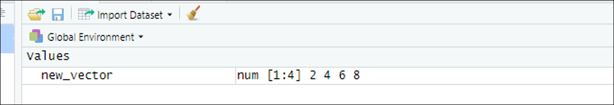
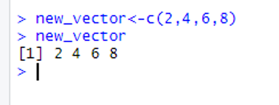
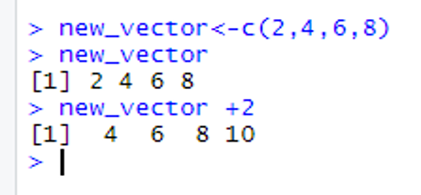
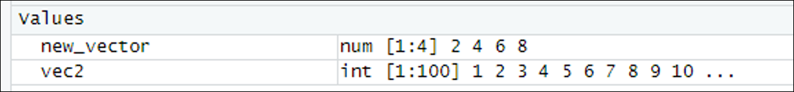
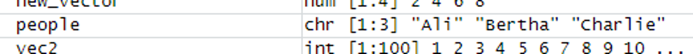

# Vectors 

## Introduction 

This document is part of our "First Steps in ***R***" resources. It is assumed that the reader has downloaded ***R*** and ***RStudio*** and is familiar with the idea of typing commands into the console. If you would like a reminder of these ideas, resources can be found on the MASH website.

John Chambers, one of the creators of the ***R*** programming language, once said "To understand computations in ***R***, two slogans are helpful: 1. Everything that exists is an object. 2. Everything that happens is a function call." Objects in ***R*** come in various categories such as Vectors, Matrices, Data Frames and Lists. The simplest of these is vectors.

The word vector is used in different ways in different contexts. In ***R*** we can think of a vector "as a list of things in order", similar to the idea of a vector in mathematics.

## Defining a Numerical Vector

To define a new object in ***R*** we must give it a name. The name must be a continuous string of characters with no spaces. For example, if we wanted to define an object called "New Vector" sensible names would be

    <code style="color: blue;">NewVector</code> 
    <code style="color: blue;">new_vector</code> 
    <code style="color: blue;">new.vector</code>    

Once we have chosen a name for our new object, we need to assign it a value. We do this with the assignment operator

    <code style="color: blue;">&lt;-</code>

So if we type

    <code style="color: blue;">new_vector &lt;-</code>

we have so far told ***R*** that we are going to define a new object called <code style="color: blue;">new_vector</code>. What we type next will be the definition of the object. To define a vector we need to use the letter c for "combine". So the command

    <code style="color: blue;">new_vector &lt;- c(2,4,6,8)</code>

would be read by ***R*** as "combine the numbers $2, 4, 6$ and $8$ into a vector and give them the label <code style="color: blue;">new_vector</code>". Note that the elements of a vector must be separated by commas as shown.

When typing code it is important to be precise. A single character out of place might make the code unreadable for the computer. However, ***R*** will ignore spaces (unless they are in the middle of the name of the object). So ***R*** would read all of the following identically:

    <code style="color: blue;">new_vector &lt;- c(2,4,6,8)</code> 
    <code style="color: blue;">new_vector &lt;- c( 2 , 4 , 6 , 8 )</code> 
    <code style="color: blue;">new_vector &lt;-c(2,4 ,   6 ,  8)</code>

Define an object called <code style="color: blue;">new_vector</code> as above and look what happened in the "Environment" window (top right). You should see that the vector has appeared in the environment as follows:

<figure>
    

        
        <figcaption style="text-align:center">
            Figure 1: The top right window (the "Environment") in <b><em>RStudio</b></em>, where <code style="color: blue;">new_vector</code> is shown to be stored as a numerical vector.
        </figcaption>
    

</figure>

"num" means that the vector has been stored by ***R*** as a numerical vector and ***R*** is reading the elements of the vector as numbers; <code>1:4</code> means that ***R*** has labelled the elements of the vector as first, second, third and fourth and the final part lists the elements of the vector.

We can now ask ***R*** to show us the vector by typing in the console window:

    <code style="color: blue;">new_vector</code>

***R*** will then display our vector like so:

<figure>
    

        
        <figcaption style="text-align:center">
            Figure 2: <code style="color: blue;">new_vector</code> is shown in the console in <b><em>RStudio</b></em>.
        </figcaption>
    

</figure>

The <code>[1]</code> means that the first entry on that line is the first element of the vector.

We can also carry out calculations with our vector. Type the following:

    <code style="color: blue;">new_vector +2</code>

and ***R*** will add $2$ to each element of the vector like so:

<figure>
    

        
        <figcaption style="text-align:center">
            Figure 3: $2$ is added to each element of <code style="color: blue;">new_vector</code> in the console in <b><em>RStudio</b></em>.
        </figcaption>
    

</figure>

## Vectors using ":"

Type the following into the console

    <code style="color: blue;">vec2 &lt;- 1:100</code> 
    <code style="color: blue;">vec2</code>

The first line defines a new object called <code style="color: blue;">vec2</code> and the second line asks ***R*** to display that object. You should see that <code style="color: blue;">vec2</code> is a vector which consists of the whole numbers from $1$ to $100$. Looking in the environment will confirm that ***R*** has stored <code style="color: blue;">vec2</code> as a numerical vector:

<figure>
    

        
        <figcaption style="text-align:center">
            Figure 4: The "Environment" window in <b><em>RStudio</b></em> where <code style="color: blue;">vec2</code> is shown to be stored as a numerical vector.
        </figcaption>
    

</figure>

":" is a shortcut to create vectors like this. Experiment by typing the following commands into the console 

    <code style="color: blue;">2:16</code> 
    <code style="color: blue;">5.6:14</code> 
    <code style="color: blue;">3.9:10</code>

## Character Vectors

A character vector is similar to a numerical vector but ***R*** will interpret the elements as words rather than numbers. This might be helpful if, for example, we have some data about different people and we want to include a list of their names. We define a character vector just like a numerical vector but we must put each element of the vector in inverted commas in the definition. For example:

    <code style="color: blue;">people &lt;- c("Ali”, “Bertha”, “Charlie”)</code>

defines a character vector called <code style="color: blue;">people</code> which would store the names Ali, Bertha and Charlie. If you type this into the console you will see the new object appear in the environment like so:

<figure>
    

        
        <figcaption style="text-align:center">
            Figure 5: The top right window (the "Environment") in <b><em>RStudio</b></em> where <code style="color: blue;">people</code> is shown to be stored as a character vector.
        </figcaption>
    

</figure>

"chr" shows that ***R*** is interpreting <code style="color: blue;">people</code> as a character vector. Note that we did not need to tell ***R*** what sort of vector we were defining. Putting the elements in inverted commas was enough for ***R*** to know that our vector was a character vector.

The elements of a character vector are called **strings**.

In ***R*** " can often be replaced by ' without noticing the difference. The usual convention is to use ".

(For completeness: if, for some reason, you want to define a string which contains the character ", you should use ' at the beginning and the end of the definition.)

You will sometimes see vectors referred to as **atomic vectors**, which means that they can only contain one type of data. For example, a vector can contain either numeric or character values but not both in the same vector. If we try to define a vector with some numbers and some character strings, ***R*** will interpret the numbers as character strings.

## Exercise

1. Define a new vector called <code style="color: blue;">vec3</code> which stores the numbers $3$, $4$, $7$, $9$, $12$.
2. Predict what the following code will do:

    <code style="color: blue;">vec3*1:5</code>

Now type the code in the console and check your prediction.
3. Predict what the following code will do:

    <code style="color: blue;">vec3+1:3</code>

Now type the code in the console and check your prediction.
4. Create a character vector <code style="color: blue;">ice.cream</code> which contains the names of your favourite flavours of ice cream.  

(Note that in question $3$ we get an output along with the warning message. When ***R*** runs out of values in the second vector, it starts again with the first element.)

### Solutions

Solutions

Here is the code used to do the above exercise:

1. <code style="color: blue;">&gt; vec3 &lt;- c(3,4,7,9,12)</code>  
<code style="color: blue;">&gt; vec3</code>  
<code>[1]  3  4  7  9 12</code>

2. <code style="color: blue;">&gt; vec3*1:5</code>  
<code>[1]  3  8 21 36 60</code>  

3. <code style="color: blue;">&gt; vec3+1:3</code>  
<code>[1]  4  6 10 10 14</code>  
<code style="color: red;">Warning message:</code>  
<code style="color: red;">In vec3 + 1:3 :</code>  
<code style="color: red;">  longer object length is not a multiple of shorter object length</code>  

4. <code style="color: blue;">&gt; ice.cream &lt;- c("vanilla","coffee","strawberry")</code>  
<code style="color: blue;">&gt; ice.cream</code>  
<code>[1] "vanilla"   "coffee"   "strawberry"</code>  

Additional notes:  
2\. <code style="color: blue;">vec3*1:5</code> multiplies the first element of <code style="color: blue;">vec3</code> by $1$, the second element by $2$ and so on.  
3\. <code style="color: blue;">vec3+1:3</code> adds $1$ to the first element of <code style="color: blue;">vec3</code>, $2$ to the second element and $3$ to the third element. Then ***R*** "recycles" the numbers <code style="color: blue;">1:3</code> so the fourth number in the output comes from the fourth element of <code style="color: blue;">vec3</code> plus $1$ (i.e. $9+1=10$)
   
<\details>
