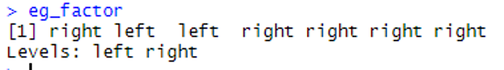
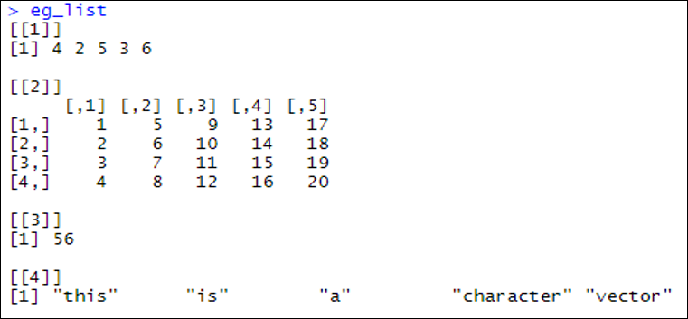
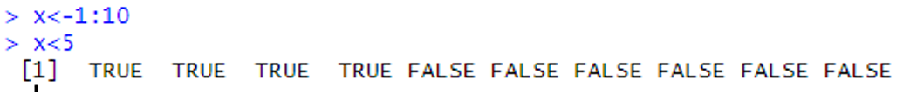
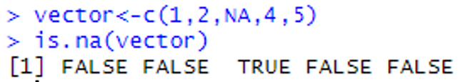

# Other objects

## Introduction 

This document is part of our "First Steps in ***R***" resources. In previous documents we discussed character and numeric vectors, matrices and data frames. It is assumed the reader is familiar with these topics. If you would like a recap, the materials are available on the MASH website. This document introduces the reader to some more commonly used kinds of object. If you are new to ***R***, it is not necessary to know all the details of every object available but it is useful to know that they exist.

## Factors

A factor is useful for storing categorical data. A factor is similar to a vector but ***R*** also keeps track of the "levels" of data. For example, if we are recording whether people are left or right handed, we might store our data in a vector like so:

    <code style="color: blue;">handed &lt;- c("right", "left", "left", "right", "right", "right", "right")</code>

If we turn this data into a factor like so

    <code style="color: blue;">eg_factor &lt;- factor(handed)</code>

We find that when we ask ***R*** to show us the object <code style="color: blue;">eg_factor</code> we get:

<figure>
    

        
        <figcaption style="text-align:center">
            Figure 1: <code style="color: blue;">eg_factor</code>, with the levels of data, is shown in the console in <b><em>RStudio</b></em>.
        </figcaption>
    

</figure>

The levels of data are <code style="color: blue;">left</code> and <code style="color: blue;">right</code> and this information is now also stored. We might need to use factors rather than character vectors because some functions expect data to be stored as a factor.

## Lists

Vectors in ***R*** contain a "list" of values. Separately, a list is also a kind of object in ***R***. A list-object can contain vectors, matrices, numbers, strings, data frames or anything else we can define as an object in ***R***. To define a list we use the command <code style="color: blue;">list()</code> and the objects we wish to put in the list go in the brackets separated by commas.

If we create several diverse objects like so:

    <code style="color: blue;">x &lt;- c(4,2,5,3,6)</code> 
    <code style="color: blue;">y &lt;- matrix(1:20,4,5)</code> 
    <code style="color: blue;">z &lt;- 8*7</code> 
    <code style="color: blue;">a &lt;- c("this", "is", "a", "character", "vector")</code>

We can then store them in a list like so:

    <code style="color: blue;">eg_list &lt;- list (x,y,z,a)</code>

When we ask ***R*** to show us this list, we get the following:

<figure>
    

        
        <figcaption style="text-align:center">
            Figure 2: The objects <code style="color: blue;">x</code>, <code style="color: blue;">y</code>, <code style="color: blue;">z</code> and <code style="color: blue;">a</code> are stored in the list <code style="color: blue;">eg_list</code>, outputted in the console in <b><em>RStudio</b></em>.
        </figcaption>
    

</figure>

## Logical Vectors

We have seen numeric and character vectors in previous documents. A third option is logical vectors. Logical values are <code style="color: blue;">TRUE</code> and <code style="color: blue;">FALSE</code>. ***R*** associates a numerical value of $1$ with <code style="color: blue;">TRUE</code> and $0$ with <code style="color: blue;">FALSE</code>.

Logical vectors are usually used to consider the properties of other vectors.

For example, if we define a vector <code style="color: blue;">x</code> as $1, 2, 3, \ldots, 10$ like so:

    <code style="color: blue;">x &lt;- 1:10</code>

Then the command

    <code style="color: blue;">x &gt; 5</code>

asks ***R*** to evaluate the statement <code style="color: blue;">x &gt; 5</code> for each element of the vector <code style="color: blue;">x</code>. A logical vector is returned like so:

<figure>
    

        
        <figcaption style="text-align:center">
            Figure 3: The statement <code style="color: blue;">x &gt; 5</code>  is evaluated for each element of the vector <code style="color: blue;">x</code>, and a logical vector is outputted in the console in <b><em>RStudio</b></em>.
        </figcaption>
    

</figure>

A useful command is:

    <code style="color: blue;">is.na(vector_name_here)</code>

which can be used like so:

<figure>
    

        
        <figcaption style="text-align:center">
            Figure 4: Each element of the vector <code style="color: blue;">vector</code> is determined if it has the value <code style="color: blue;">NA</code> and a logical vector is outputted in the console in <b><em>RStudio</b></em>.
        </figcaption>
    

</figure>

The command

    <code style="color: blue;">anyNA(vector_name_here)</code>

will return a single result that is <code style="color: blue;">TRUE</code> if a vector contains one or more value of <code style="color: blue;">NA</code> and <code style="color: blue;">FALSE</code> if there are no missing values in the vector.

## Arrays

A matrix can be thought of as a $2$-dimensional "grid" of numbers (or character strings) like so:

$$ \begin{array}{|c|c|c|c|}
\hline
2 & 4 & 1 & -5 \\ \hline
2 & 0 & 2 & 10 \\ \hline
-8 & -1 & 6 & 8 \\ \hline
0 & -6 & -7 & 9 \\ \hline
3 & 21 & 4 & 8 \\ \hline
\end{array}  $$

An array is the same as a matrix except we can have more than $2$ dimensions. For example, we can picture a $3$-dimensional array like the cube below. We would have one value in each of the small cubes:

<figure>
    

        
        <figcaption style="text-align:center">
            Figure 5: A cube representing a $3$-dimensional array.
        </figcaption>
    

</figure>

In ***R*** we can define an array like so:

    <code style="color: blue;">array_name &lt;- array (data, dim = dimensions)</code>

Here <code style="color: blue;">data</code> is a vector containing the values to be put into the array and <code style="color: blue;">dimensions</code> is a vector containing the dimensions of the array.

Example: If we wish to arrange the numbers $1$ to $27$ into a $3 \times 3 \times 3$ cube we can do so thus:

    <code style="color: blue;">eg_array &lt;- array(1:27, dim = c(3,3,3))</code>

***R*** displays the array by showing one "layer" of the cube at a time like so:

<figure>
    

        
        <figcaption style="text-align:center">
            Figure 6: The array <code style="color: blue;">eg_array</code> is outputted in the console in <b><em>RStudio</b></em>.
        </figcaption>
    

</figure>
